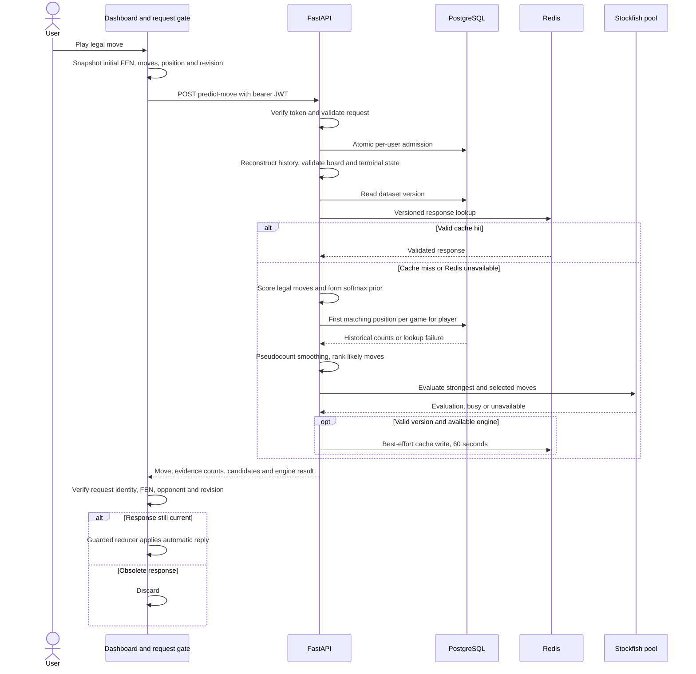
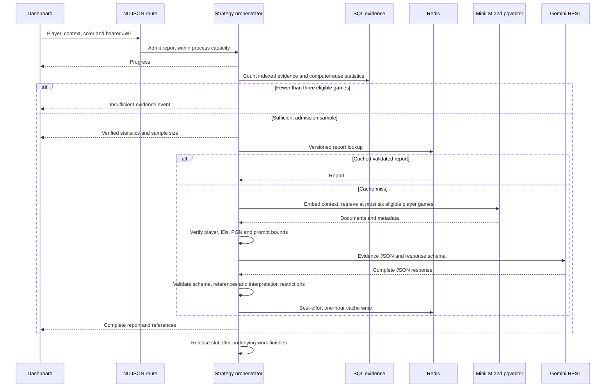
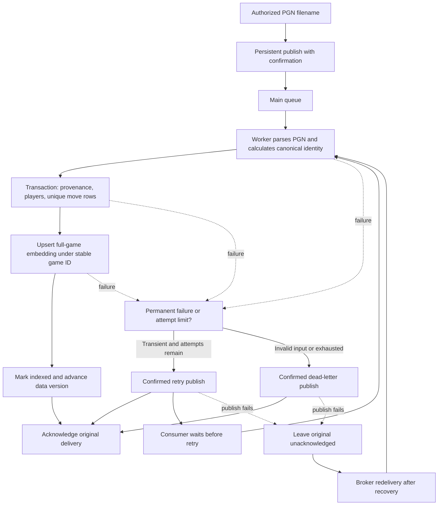
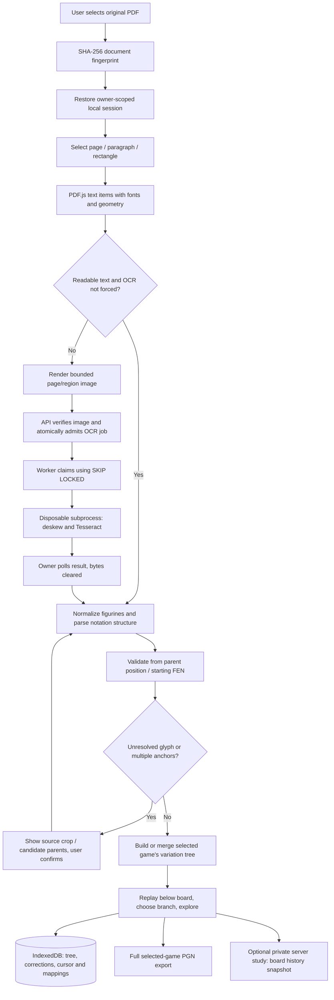

# NeuroChess architecture diagrams

Source baseline: **49f6cfe0950522e33d2c28785a42113bb24380ee**, reviewed 5 October 2026. These diagrams describe the repository configuration and code paths, not a claim that every optional service is deployed.

Return to the [deep-dive report](PROJECT_DEEP_DIVE.md) or [interview questions](INTERVIEW_QUESTIONS.md). The editable Mermaid sources are in [diagrams/](diagrams/).

Standalone SVG diagrams for presentations: [full system](diagrams/system.svg), [move prediction](diagrams/move-prediction.svg), [strategy reports](diagrams/strategy-report.svg), [ingestion](diagrams/ingestion.svg), [PDF reader](diagrams/pdf-reader.svg), and [database](diagrams/database.svg).

## 1. Full system architecture

```mermaid
flowchart TB
  subgraph client["Browser and local study state"]
    Player["Player / coach"] --> SPA["React + Vite SPA"]
    SPA --> Routes["Home / Prediction / Book reader"]
    Routes --> State["Redux workspace + RTK Query"]
    Routes --> Reader["PDF.js worker + chess.js parser"]
    Reader --> Tree["Document game trees, review and figurine mappings"]
    Tree <--> Local[("IndexedDB: owner + document fingerprint")]
  end

  subgraph apiLayer["Python API process"]
    API["FastAPI + Uvicorn"] --> Auth["JWT verification + per-user admission"]
    Auth --> Moves["Legal position + historical likelihood"]
    Auth --> Reports["SQL evidence + filtered RAG + report validation"]
    Auth --> Studies["Owner-scoped studies"]
    Auth --> OcrSubmit["Image checks + OCR job submission"]
    Auth --> Ingest["Restricted PGN ingestion endpoint"]
    Moves --> Engines["Bounded Stockfish 18 UCI process pool"]
    Reports --> QueryEmbed["MiniLM query embedding"]
  end

  subgraph data["Shared data services / internal production network"]
    PG[("PostgreSQL: games, moves, players, imports, studies, limits")]
    Vec[("pgvector tables in PostgreSQL")]
    Jobs[("OCR jobs in PostgreSQL: bytes, owner, state, result")]
    Redis[("Redis: optional response caches")]
    Rabbit["RabbitMQ: main / retry / dead queues"]
  end

  subgraph background["Independent background processes"]
    Files["Approved PGN directory"] --> Ingestion["PGN worker: validate, deduplicate, index"]
    Ingestion --> DocEmbed["MiniLM document embedding"]
    OCR["OCR worker: claim job + bounded subprocess"] --> Image["PyMuPDF / Pillow / Tesseract"]
    Migrate["Privileged migration job"]
  end

  subgraph external["External providers"]
    Asgardeo["Asgardeo: sign-in and JWKS"]
    Gemini["Gemini REST: structured interpretation"]
    HF["Hugging Face model download on cache miss"]
    Bucket[("Optional private S3-compatible backup bucket")]
  end

  subgraph ops["Operations and optional profiles"]
    ModelFiles[("Persistent model-file cache")]
    Prom["Prometheus metrics and alerts"]
    Jaeger["Jaeger / OTLP traces"]
    Backup["Scheduled pg_dump + restore verification"]
    Upload["Optional AWS CLI uploader"]
    CI["GitHub Actions: isolated tests + browser checks"]
  end

  SPA <-->|"SDK-managed sign-in"| Asgardeo
  SPA -->|"Bearer JWT, JSON, selected image"| API
  API -->|"NDJSON progress / statistics / report"| SPA
  Auth -->|"Signing-key lookup"| Asgardeo
  Auth --> PG
  Moves --> PG
  Moves <--> Redis
  Reports --> PG
  Reports <--> Redis
  QueryEmbed --> Vec
  Reports -->|"Bounded SQL facts + selected PGNs"| Gemini
  Studies --> PG
  OcrSubmit --> Jobs
  Ingest --> Rabbit
  Rabbit --> Ingestion
  Ingestion --> PG
  DocEmbed --> Vec
  Jobs --> OCR
  Image -->|"Result, original bytes cleared"| Jobs
  Migrate --> PG
  Migrate --> Vec
  Migrate --> Jobs
  HF --> ModelFiles
  ModelFiles --> QueryEmbed
  ModelFiles --> DocEmbed
  API -.-> Prom
  Ingestion -.-> Prom
  OCR -.-> Prom
  API -.-> Jaeger
  Ingestion -.-> Jaeger
  OCR -.-> Jaeger
  PG --> Backup
  Backup --> Upload
  Upload -.-> Bucket
  CI -.-> API
  CI -.-> SPA
```

PostgreSQL is drawn as multiple logical stores for readability; these are not separate database deployments. The frontend can run through Vite locally or its Nginx image; base Compose defines no frontend service. Redis is optional for successful computation, while database admission remains required. OCR uses PostgreSQL jobs, **not RabbitMQ**. S3 integration is opt-in backup infrastructure, **not PDF recognition**.

Sources: [docker-compose.yml:1](https://github.com/YasiruUpananda/chess-prediction-platform/blob/49f6cfe0950522e33d2c28785a42113bb24380ee/docker-compose.yml#L1), [docker-compose.production.yml:1](https://github.com/YasiruUpananda/chess-prediction-platform/blob/49f6cfe0950522e33d2c28785a42113bb24380ee/docker-compose.production.yml#L1), [services/ml-engine/main.py:339](https://github.com/YasiruUpananda/chess-prediction-platform/blob/49f6cfe0950522e33d2c28785a42113bb24380ee/services/ml-engine/main.py#L339), [services/ml-engine/worker.py:38](https://github.com/YasiruUpananda/chess-prediction-platform/blob/49f6cfe0950522e33d2c28785a42113bb24380ee/services/ml-engine/worker.py#L38), [services/ml-engine/ocr_jobs.py:15](https://github.com/YasiruUpananda/chess-prediction-platform/blob/49f6cfe0950522e33d2c28785a42113bb24380ee/services/ml-engine/ocr_jobs.py#L15).

## 2. Move prediction sequence

Sources: [frontend/src/features/prediction/Dashboard.jsx:92](https://github.com/YasiruUpananda/chess-prediction-platform/blob/49f6cfe0950522e33d2c28785a42113bb24380ee/frontend/src/features/prediction/Dashboard.jsx#L92), [services/ml-engine/main.py:339](https://github.com/YasiruUpananda/chess-prediction-platform/blob/49f6cfe0950522e33d2c28785a42113bb24380ee/services/ml-engine/main.py#L339), [services/ml-engine/prediction_model.py:71](https://github.com/YasiruUpananda/chess-prediction-platform/blob/49f6cfe0950522e33d2c28785a42113bb24380ee/services/ml-engine/prediction_model.py#L71). The actual selected reply comes from historical/heuristic likelihood; engine strength is a separate assessment.

## 3. Evidence-first report sequence

“Streaming” here refers to application progress/statistics events. The Gemini request is not provider token streaming. Sources: [services/ml-engine/main.py:479](https://github.com/YasiruUpananda/chess-prediction-platform/blob/49f6cfe0950522e33d2c28785a42113bb24380ee/services/ml-engine/main.py#L479), [services/ml-engine/predict_opponent.py:275](https://github.com/YasiruUpananda/chess-prediction-platform/blob/49f6cfe0950522e33d2c28785a42113bb24380ee/services/ml-engine/predict_opponent.py#L275).

## 4. Ingestion and recovery

Acknowledgment after a confirmed replacement prevents losing work in the ordinary failed-job path. A crash can still duplicate delivery, which is why effect idempotency matters. Sources: [services/ml-engine/task_queue.py:47](https://github.com/YasiruUpananda/chess-prediction-platform/blob/49f6cfe0950522e33d2c28785a42113bb24380ee/services/ml-engine/task_queue.py#L47), [services/ml-engine/worker.py:116](https://github.com/YasiruUpananda/chess-prediction-platform/blob/49f6cfe0950522e33d2c28785a42113bb24380ee/services/ml-engine/worker.py#L116).

## 5. PDF, review, persistence and OCR

Local document trees and server board snapshots have different scopes. Original PDF bytes are not stored in the local session library. Source coordinates/highlights are approximate. Sources: [frontend/src/features/reader/readerExtraction.js:5](https://github.com/YasiruUpananda/chess-prediction-platform/blob/49f6cfe0950522e33d2c28785a42113bb24380ee/frontend/src/features/reader/readerExtraction.js#L5), [frontend/src/features/reader/bookReplay.js:4](https://github.com/YasiruUpananda/chess-prediction-platform/blob/49f6cfe0950522e33d2c28785a42113bb24380ee/frontend/src/features/reader/bookReplay.js#L4), [services/ml-engine/studies.py:15](https://github.com/YasiruUpananda/chess-prediction-platform/blob/49f6cfe0950522e33d2c28785a42113bb24380ee/services/ml-engine/studies.py#L15).

## 6. Database relationships

Solid relationships below represent actual declared foreign keys. Dashed relationships are conceptual/application-maintained. Operational tables are shown separately because a user identity is verified by Asgardeo; there is no local `users` table joining them.

```mermaid
erDiagram
  PLAYERS ||--o{ PLAYER_ALIASES : has
  PLAYERS ||--o{ GAME_PARTICIPANTS : participates
  PLAYERS ||--o{ PLAYER_MOVES : identified_player
  INGESTED_GAMES ||--o{ GAME_PARTICIPANTS : contains
  INGESTED_GAMES ||--o{ GAME_EXPORTS : provenance
  IMPORT_BATCHES ||--o{ GAME_EXPORTS : records
  LANGCHAIN_PG_COLLECTION ||--o{ LANGCHAIN_PG_EMBEDDING : contains
  INGESTED_GAMES ||..o{ PLAYER_MOVES : logical_game_id
  INGESTED_GAMES ||..o| LANGCHAIN_PG_EMBEDDING : logical_shared_id

  PLAYERS {
    text id PK
    text name
    text fide_id UK
    text federation
    boolean reviewed
  }
  INGESTED_GAMES {
    text id PK
    text canonical_id
    text duplicate_of
    boolean indexed
    text played_date
    text event
  }
  PLAYER_MOVES {
    bigint id PK
    text game_id
    int ply
    text player_id FK
    text position_key
    text fen
    text move_played
    text san
  }
  GAME_PARTICIPANTS {
    text game_id PK,FK
    text color PK
    text player_id FK
    text original_name
  }
  PLAYER_ALIASES {
    text player_id PK,FK
    text alias PK
  }
  IMPORT_BATCHES {
    uuid id PK
    text source_name
    text source_hash
    text status
  }
  GAME_EXPORTS {
    text game_id PK,FK
    uuid batch_id PK,FK
    jsonb headers
  }
  LANGCHAIN_PG_COLLECTION {
    uuid uuid PK
    varchar name UK
  }
  LANGCHAIN_PG_EMBEDDING {
    varchar id PK
    uuid collection_id FK
    vector embedding
    varchar document
    jsonb cmetadata
  }
  SAVED_STUDIES {
    uuid id PK
    text owner
    text title
    jsonb snapshot
  }
  OCR_JOBS {
    uuid id PK
    text owner
    text status
    bytea pdf
    jsonb result
    text cache_key
  }
  REQUEST_LIMITS {
    text owner PK
    text operation PK
    bigint window_id
    int count
  }
  DATASET_VERSION {
    int id PK
    bigint version
  }
  SERVICE_HEARTBEATS {
    text name PK
    timestamptz seen_at
  }
  SCHEMA_MIGRATIONS {
    text version PK
    text checksum
    timestamptz applied_at
  }
```

The unique game/ply index and partial canonical identity index are additional constraints not fully expressed by Mermaid's attribute notation. `duplicate_of` is not declared as a self-referencing FK. Source: [services/ml-engine/migrations/0001_platform.sql:1](https://github.com/YasiruUpananda/chess-prediction-platform/blob/49f6cfe0950522e33d2c28785a42113bb24380ee/services/ml-engine/migrations/0001_platform.sql#L1), [services/ml-engine/migrations/0003_vectors_identity.sql:1](https://github.com/YasiruUpananda/chess-prediction-platform/blob/49f6cfe0950522e33d2c28785a42113bb24380ee/services/ml-engine/migrations/0003_vectors_identity.sql#L1).
