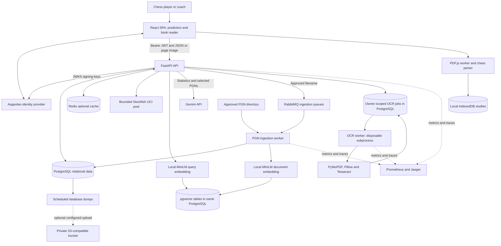

# NeuroChess: project deep dive and interview reference

Prepared: **5 October 2026**. Source baseline: **49f6cfe0950522e33d2c28785a42113bb24380ee**.

This report describes the implementation at that commit. Source links point to that immutable revision so their line numbers remain meaningful after later changes. Configuration defaults are not proof of a live deployment's settings. Previously recorded test results and benchmarks are identified separately from architectural reasoning.

Read alongside the [interview question bank](INTERVIEW_QUESTIONS.md), [architecture diagrams](ARCHITECTURE.md), and [documentation index](../README.md). This is an implementation-based preparation guide, not a claim that every possible interview question has been anticipated.

## Contents

1. [Project purpose and motivation](#1-project-purpose-and-motivation)
2. [Architecture and system boundaries](#2-architecture-and-system-boundaries)
3. [Technology inventory](#3-technology-inventory)
4. [Why these technology choices](#4-why-these-technology-choices)
5. [Chess representations and invariants](#5-chess-representations-and-invariants)
6. [Move prediction: exact implementation](#6-move-prediction-exact-implementation)
7. [Stockfish and neural evaluation](#7-stockfish-and-neural-evaluation)
8. [RAG and embeddings](#8-rag-and-embeddings)
9. [Gemini generation and evidence controls](#9-gemini-generation-and-evidence-controls)
10. [Dataset ingestion and identity](#10-dataset-ingestion-and-identity)
11. [PDF reader and OCR](#11-pdf-reader-and-ocr)
12. [Frontend state and concurrency](#12-frontend-state-and-concurrency)
13. [Database design and consistency](#13-database-design-and-consistency)
14. [OOP and design principles](#14-oop-and-design-principles)
15. [Data structures and complexity](#15-data-structures-and-complexity)
16. [Security and privacy](#16-security-and-privacy)
17. [Concurrency, reliability, and caching](#17-concurrency-reliability-and-caching)
18. [Evaluation and testing](#18-evaluation-and-testing)
19. [Deployment and observability](#19-deployment-and-observability)
20. [Limitations and next steps](#20-limitations-and-next-steps)
21. [Demonstration and presentation](#21-demonstration-and-presentation)
22. [Source reading map](#22-source-reading-map)

## 1. Project purpose and motivation

### 1.1 What is NeuroChess?

NeuroChess is a chess preparation and study platform with four connected workflows:

| Workflow | User question | Implementation |
| --- | --- | --- |
| Opponent move prediction | “What is this player likely to play here?” | Legal-move heuristic plus sample-aware historical move counts |
| Engine analysis | “What does a strong engine recommend?” | Bounded Stockfish processes returning evaluations and candidate moves |
| Strategy reports | “What does the available evidence suggest about this player?” | SQL statistics, player-filtered vector retrieval, and structured Gemini interpretation |
| Interactive book study | “How can I replay and explore the moves printed in this PDF?” | Browser PDF extraction, notation parsing, variation trees, confirmed figurine mappings, and targeted OCR |

The frontend is a Vite/React single-page application. The backend is a Python/FastAPI API with separate ingestion and OCR worker processes. PostgreSQL holds relational records and pgvector embeddings; Redis caches recomputable responses; RabbitMQ transports ingestion jobs. Source: [frontend/src/app/App.jsx:44](https://github.com/YasiruUpananda/chess-prediction-platform/blob/49f6cfe0950522e33d2c28785a42113bb24380ee/frontend/src/app/App.jsx#L44), [services/ml-engine/main.py:51](https://github.com/YasiruUpananda/chess-prediction-platform/blob/49f6cfe0950522e33d2c28785a42113bb24380ee/services/ml-engine/main.py#L51), [docker-compose.yml:92](https://github.com/YasiruUpananda/chess-prediction-platform/blob/49f6cfe0950522e33d2c28785a42113bb24380ee/docker-compose.yml#L92).

### 1.2 Why build it?

The defensible product motivation is to reduce fragmentation in chess preparation. A player might otherwise search a game database, inspect an engine, read a PDF, manually replay its notation, and keep notes elsewhere. This project brings these activities into one workspace while exposing the evidence behind predictions.

The conversation also establishes an interest in broader coverage of Sri Lankan players whose games are available through ChessBase exports. The repository supports roster-based country filtering and reviewed player identities. It does not establish that every Sri Lankan player's games have been acquired. A roster of player identities and a corpus of played games are different datasets. Source: [services/ml-engine/build_country_roster.py:9](https://github.com/YasiruUpananda/chess-prediction-platform/blob/49f6cfe0950522e33d2c28785a42113bb24380ee/services/ml-engine/build_country_roster.py#L9), [services/ml-engine/prepare_country_dataset.py:15](https://github.com/YasiruUpananda/chess-prediction-platform/blob/49f6cfe0950522e33d2c28785a42113bb24380ee/services/ml-engine/prepare_country_dataset.py#L15), [services/ml-engine/player_identity.py:29](https://github.com/YasiruUpananda/chess-prediction-platform/blob/49f6cfe0950522e33d2c28785a42113bb24380ee/services/ml-engine/player_identity.py#L29).

**Suggested first-person explanation—adapt it to your actual experience:**

> I built NeuroChess to connect opponent preparation with practical chess study. I wanted users to distinguish a player's historical habits from the engine's strongest move, see the evidence behind a strategy report, and turn notation in chess books into an interactive study tree. The engineering challenge was making that workflow reliable despite sparse game data, irregular PDF notation, external model latency, and background processing failures.

This is a suggested presentation, not a verified claim about your original personal motivation or individual authorship of every component. Explain your actual contribution honestly, including libraries, pretrained models, and development assistance.

### 1.3 What is the original engineering contribution?

The contribution is the integration and domain logic: sample-aware prediction, verified player scoping, SQL-backed report evidence, durable ingestion, chess-aware PDF reconstruction, preservation of study trees, stale-response protection, and operational safeguards. Stockfish, MiniLM, Gemini, PDF.js, chess.js, and Tesseract are existing technologies integrated into that system.

### 1.4 What should you avoid claiming?

- There is no custom trained neural next-move predictor in this repository.
- Ingesting PGNs adds records and embeddings; it does not retrain Gemini, MiniLM, or Stockfish.
- An embedding similarity score is not a chess evaluation or win probability.
- A legal extracted line is not necessarily the complete or correctly interpreted printed line.
- Source citations reduce unsupported output but do not prove that prose logically follows from those sources.
- The application streams progress and statistics, then a complete report; it does not currently stream individual Gemini tokens.
- Having tests and a production Compose overlay does not prove high availability or Internet-scale capacity.

## 2. Architecture and system boundaries

The application is best described as a **modular backend with separately deployed workers**, rather than a collection of fully independent domain microservices. API, ingestion, and OCR use shared code and one database. Their separate processes let CPU-heavy work and retries be isolated from interactive HTTP traffic.



The diagram separates responsibilities, not necessarily machines. Relational records, OCR jobs, and vectors share the PostgreSQL deployment. Both API and ingestion may load their own embedding model into process memory; the downloaded model files share a persistent volume. S3 is an optional backup destination, not the PDF parser or a currently required document store. Source: [docker-compose.yml:136](https://github.com/YasiruUpananda/chess-prediction-platform/blob/49f6cfe0950522e33d2c28785a42113bb24380ee/docker-compose.yml#L136), [docker-compose.yml:173](https://github.com/YasiruUpananda/chess-prediction-platform/blob/49f6cfe0950522e33d2c28785a42113bb24380ee/docker-compose.yml#L173), [docker-compose.backups.yml:3](https://github.com/YasiruUpananda/chess-prediction-platform/blob/49f6cfe0950522e33d2c28785a42113bb24380ee/docker-compose.backups.yml#L3).

### 2.1 The important boundaries

1. **Browser/server:** browser state is not trusted authorization or authoritative chess legality. The server validates requests again.
2. **Synchronous request/background work:** ingestion receives a filename and publishes a durable job; OCR submits a bounded PostgreSQL job. The request does not wait for the entire task.
3. **Deterministic evidence/generated interpretation:** SQL supplies counts and references; Gemini supplies labelled qualitative interpretation.
4. **Prediction/evaluation:** the likely opponent move and Stockfish's preferred move are separate outputs.
5. **Private state/shared corpus:** saved studies and OCR results are owner-scoped. The indexed opponent-game corpus is shared among authorized users, not tenant-partitioned per uploader.

See [ARCHITECTURE.md](ARCHITECTURE.md) for request sequences, deployment relationships, and the database diagram.

## 3. Technology inventory

Versions below describe manifest constraints or pinned code, not a claim about the newest available release. Exact Python resolution is in `uv.lock`; exact JavaScript resolution is in `package-lock.json`.

| Technology | Where and why used | Source |
| --- | --- | --- |
| Python 3.11 | Backend, ingestion, OCR orchestration, evaluation utilities | [services/ml-engine/pyproject.toml:4](https://github.com/YasiruUpananda/chess-prediction-platform/blob/49f6cfe0950522e33d2c28785a42113bb24380ee/services/ml-engine/pyproject.toml#L4) |
| FastAPI + Starlette/ASGI | HTTP routes, dependencies, streaming, middleware and lifecycle | [services/ml-engine/main.py:42](https://github.com/YasiruUpananda/chess-prediction-platform/blob/49f6cfe0950522e33d2c28785a42113bb24380ee/services/ml-engine/main.py#L42) |
| Uvicorn | ASGI process serving `main:app` | [services/ml-engine/Dockerfile:24](https://github.com/YasiruUpananda/chess-prediction-platform/blob/49f6cfe0950522e33d2c28785a42113bb24380ee/services/ml-engine/Dockerfile#L24) |
| Pydantic 2 | Request/response contracts and model-output validation | [services/ml-engine/main.py:115](https://github.com/YasiruUpananda/chess-prediction-platform/blob/49f6cfe0950522e33d2c28785a42113bb24380ee/services/ml-engine/main.py#L115), [services/ml-engine/predict_opponent.py:57](https://github.com/YasiruUpananda/chess-prediction-platform/blob/49f6cfe0950522e33d2c28785a42113bb24380ee/services/ml-engine/predict_opponent.py#L57) |
| React 19 + React DOM | Interactive application and component composition | [frontend/src/main.jsx:1](https://github.com/YasiruUpananda/chess-prediction-platform/blob/49f6cfe0950522e33d2c28785a42113bb24380ee/frontend/src/main.jsx#L1) |
| Vite 8 | Development server, production bundling, lazy chunk generation | [frontend/vite.config.js:8](https://github.com/YasiruUpananda/chess-prediction-platform/blob/49f6cfe0950522e33d2c28785a42113bb24380ee/frontend/vite.config.js#L8) |
| React Router | `/`, `/predict`, `/reader`, protected area and fallback route | [frontend/src/app/App.jsx:44](https://github.com/YasiruUpananda/chess-prediction-platform/blob/49f6cfe0950522e33d2c28785a42113bb24380ee/frontend/src/app/App.jsx#L44) |
| JavaScript + TypeScript | UI and parser code, typed API wrappers and selected components | [frontend/tsconfig.json:1](https://github.com/YasiruUpananda/chess-prediction-platform/blob/49f6cfe0950522e33d2c28785a42113bb24380ee/frontend/tsconfig.json#L1), [frontend/src/lib/apiClient.ts:1](https://github.com/YasiruUpananda/chess-prediction-platform/blob/49f6cfe0950522e33d2c28785a42113bb24380ee/frontend/src/lib/apiClient.ts#L1) |
| Redux Toolkit | Shared board/workspace state with guarded reducers | [frontend/src/store/chessSlice.js:18](https://github.com/YasiruUpananda/chess-prediction-platform/blob/49f6cfe0950522e33d2c28785a42113bb24380ee/frontend/src/store/chessSlice.js#L18) |
| RTK Query | Player/study query caching and study mutation invalidation | [frontend/src/store/chessApi.ts:12](https://github.com/YasiruUpananda/chess-prediction-platform/blob/49f6cfe0950522e33d2c28785a42113bb24380ee/frontend/src/store/chessApi.ts#L12) |
| Asgardeo React SDK | Sign-in and access-token acquisition | [frontend/src/features/auth/SdkSession.jsx:6](https://github.com/YasiruUpananda/chess-prediction-platform/blob/49f6cfe0950522e33d2c28785a42113bb24380ee/frontend/src/features/auth/SdkSession.jsx#L6) |
| PyJWT + JWKS | Server-side RS256 token verification | [services/ml-engine/token_auth.py:47](https://github.com/YasiruUpananda/chess-prediction-platform/blob/49f6cfe0950522e33d2c28785a42113bb24380ee/services/ml-engine/token_auth.py#L47) |
| chess.js | Browser legality, replay, SAN/UCI conversion and history | [frontend/src/lib/gameHistory.js:1](https://github.com/YasiruUpananda/chess-prediction-platform/blob/49f6cfe0950522e33d2c28785a42113bb24380ee/frontend/src/lib/gameHistory.js#L1), [frontend/src/features/reader/bookReplay.js:4](https://github.com/YasiruUpananda/chess-prediction-platform/blob/49f6cfe0950522e33d2c28785a42113bb24380ee/frontend/src/features/reader/bookReplay.js#L4) |
| python-chess, package constraint `chess==1.10.0` | Backend board rules, PGN parsing, legal moves and UCI engine protocol | [services/ml-engine/chess_positions.py:11](https://github.com/YasiruUpananda/chess-prediction-platform/blob/49f6cfe0950522e33d2c28785a42113bb24380ee/services/ml-engine/chess_positions.py#L11), [services/ml-engine/worker.py:51](https://github.com/YasiruUpananda/chess-prediction-platform/blob/49f6cfe0950522e33d2c28785a42113bb24380ee/services/ml-engine/worker.py#L51) |
| react-chessboard | Interactive board rendering, wrapped for responsive sizing | [frontend/src/components/ResponsiveBoard.tsx:1](https://github.com/YasiruUpananda/chess-prediction-platform/blob/49f6cfe0950522e33d2c28785a42113bb24380ee/frontend/src/components/ResponsiveBoard.tsx#L1) |
| react-pdf + PDF.js | Local rendering, text items and PDF worker | [frontend/src/features/reader/PdfDocumentView.jsx:1](https://github.com/YasiruUpananda/chess-prediction-platform/blob/49f6cfe0950522e33d2c28785a42113bb24380ee/frontend/src/features/reader/PdfDocumentView.jsx#L1) |
| IndexedDB | Local document sessions, reviewed moves and variations | [frontend/src/features/reader/readingSession.js:1](https://github.com/YasiruUpananda/chess-prediction-platform/blob/49f6cfe0950522e33d2c28785a42113bb24380ee/frontend/src/features/reader/readingSession.js#L1) |
| Stockfish 18 | Strong move evaluation through subprocess UCI connections | [services/ml-engine/install_stockfish.py:9](https://github.com/YasiruUpananda/chess-prediction-platform/blob/49f6cfe0950522e33d2c28785a42113bb24380ee/services/ml-engine/install_stockfish.py#L9), [services/ml-engine/engine_pool.py:29](https://github.com/YasiruUpananda/chess-prediction-platform/blob/49f6cfe0950522e33d2c28785a42113bb24380ee/services/ml-engine/engine_pool.py#L29) |
| Hugging Face embeddings + Sentence Transformers | Pretrained text embeddings for PGN retrieval | [services/ml-engine/rag_store.py:31](https://github.com/YasiruUpananda/chess-prediction-platform/blob/49f6cfe0950522e33d2c28785a42113bb24380ee/services/ml-engine/rag_store.py#L31) |
| PyTorch CPU and NumPy | Dependency/runtime foundation of embedding inference; no application training loop | [services/ml-engine/pyproject.toml:14](https://github.com/YasiruUpananda/chess-prediction-platform/blob/49f6cfe0950522e33d2c28785a42113bb24380ee/services/ml-engine/pyproject.toml#L14) |
| LangChain PGVector | Document insertion, metadata filtering and default vector retrieval | [services/ml-engine/rag_store.py:11](https://github.com/YasiruUpananda/chess-prediction-platform/blob/49f6cfe0950522e33d2c28785a42113bb24380ee/services/ml-engine/rag_store.py#L11), [services/ml-engine/predict_opponent.py:239](https://github.com/YasiruUpananda/chess-prediction-platform/blob/49f6cfe0950522e33d2c28785a42113bb24380ee/services/ml-engine/predict_opponent.py#L239) |
| Gemini via HTTPX REST | Structured qualitative strategy generation | [services/ml-engine/predict_opponent.py:198](https://github.com/YasiruUpananda/chess-prediction-platform/blob/49f6cfe0950522e33d2c28785a42113bb24380ee/services/ml-engine/predict_opponent.py#L198) |
| PostgreSQL 16 + pgvector | Transactions, game/move identity, studies, OCR jobs and vectors | [docker-compose.yml:29](https://github.com/YasiruUpananda/chess-prediction-platform/blob/49f6cfe0950522e33d2c28785a42113bb24380ee/docker-compose.yml#L29), [services/ml-engine/migrations/0003_vectors_identity.sql:1](https://github.com/YasiruUpananda/chess-prediction-platform/blob/49f6cfe0950522e33d2c28785a42113bb24380ee/services/ml-engine/migrations/0003_vectors_identity.sql#L1) |
| Psycopg 3 + psycopg_pool | Parameterized SQL and bounded reusable connections | [services/ml-engine/database.py:13](https://github.com/YasiruUpananda/chess-prediction-platform/blob/49f6cfe0950522e33d2c28785a42113bb24380ee/services/ml-engine/database.py#L13) |
| SQLAlchemy | Connection engine behind the PGVector adapter; also the diagnostic tool | [services/ml-engine/rag_store.py:36](https://github.com/YasiruUpananda/chess-prediction-platform/blob/49f6cfe0950522e33d2c28785a42113bb24380ee/services/ml-engine/rag_store.py#L36), [services/ml-engine/tools/check_database.py:3](https://github.com/YasiruUpananda/chess-prediction-platform/blob/49f6cfe0950522e33d2c28785a42113bb24380ee/services/ml-engine/tools/check_database.py#L3) |
| Redis 7 | Short-lived move/report response caching, with failure fallback | [services/ml-engine/main.py:364](https://github.com/YasiruUpananda/chess-prediction-platform/blob/49f6cfe0950522e33d2c28785a42113bb24380ee/services/ml-engine/main.py#L364), [services/ml-engine/predict_opponent.py:218](https://github.com/YasiruUpananda/chess-prediction-platform/blob/49f6cfe0950522e33d2c28785a42113bb24380ee/services/ml-engine/predict_opponent.py#L218) |
| RabbitMQ + Pika | Confirmed ingestion messages, retries and dead-letter handling | [services/ml-engine/task_queue.py:13](https://github.com/YasiruUpananda/chess-prediction-platform/blob/49f6cfe0950522e33d2c28785a42113bb24380ee/services/ml-engine/task_queue.py#L13) |
| PyMuPDF | Server fallback PDF text extraction/rendering | [services/ml-engine/ocr_extract.py:53](https://github.com/YasiruUpananda/chess-prediction-platform/blob/49f6cfe0950522e33d2c28785a42113bb24380ee/services/ml-engine/ocr_extract.py#L53) |
| Pillow | Image verification, cropping-related processing, grayscale and deskew | [services/ml-engine/ocr_jobs.py:34](https://github.com/YasiruUpananda/chess-prediction-platform/blob/49f6cfe0950522e33d2c28785a42113bb24380ee/services/ml-engine/ocr_jobs.py#L34), [services/ml-engine/ocr_extract.py:18](https://github.com/YasiruUpananda/chess-prediction-platform/blob/49f6cfe0950522e33d2c28785a42113bb24380ee/services/ml-engine/ocr_extract.py#L18) |
| Tesseract + pytesseract | OCR of selected page images or notation regions | [services/ml-engine/ocr_extract.py:36](https://github.com/YasiruUpananda/chess-prediction-platform/blob/49f6cfe0950522e33d2c28785a42113bb24380ee/services/ml-engine/ocr_extract.py#L36) |
| OpenTelemetry + OTLP + Jaeger | Sampled spans for API and background work | [services/ml-engine/telemetry.py:15](https://github.com/YasiruUpananda/chess-prediction-platform/blob/49f6cfe0950522e33d2c28785a42113bb24380ee/services/ml-engine/telemetry.py#L15), [docker-compose.yml:21](https://github.com/YasiruUpananda/chess-prediction-platform/blob/49f6cfe0950522e33d2c28785a42113bb24380ee/docker-compose.yml#L21) |
| Prometheus | Aggregated latency, queue, cache, job and cost measurements | [services/ml-engine/metrics.py:9](https://github.com/YasiruUpananda/chess-prediction-platform/blob/49f6cfe0950522e33d2c28785a42113bb24380ee/services/ml-engine/metrics.py#L9), [monitoring/prometheus.yml:1](https://github.com/YasiruUpananda/chess-prediction-platform/blob/49f6cfe0950522e33d2c28785a42113bb24380ee/monitoring/prometheus.yml#L1) |
| Web Vitals | Optional browser experience measurements | [frontend/src/lib/browserVitals.js:1](https://github.com/YasiruUpananda/chess-prediction-platform/blob/49f6cfe0950522e33d2c28785a42113bb24380ee/frontend/src/lib/browserVitals.js#L1) |
| Docker / Compose | Separate runtime images, networks, volumes and health checks | [services/ml-engine/Dockerfile:1](https://github.com/YasiruUpananda/chess-prediction-platform/blob/49f6cfe0950522e33d2c28785a42113bb24380ee/services/ml-engine/Dockerfile#L1), [docker-compose.production.yml:1](https://github.com/YasiruUpananda/chess-prediction-platform/blob/49f6cfe0950522e33d2c28785a42113bb24380ee/docker-compose.production.yml#L1) |
| uv | Locked Python dependencies and per-image dependency groups | [services/ml-engine/Dockerfile:2](https://github.com/YasiruUpananda/chess-prediction-platform/blob/49f6cfe0950522e33d2c28785a42113bb24380ee/services/ml-engine/Dockerfile#L2), [services/ml-engine/pyproject.toml:21](https://github.com/YasiruUpananda/chess-prediction-platform/blob/49f6cfe0950522e33d2c28785a42113bb24380ee/services/ml-engine/pyproject.toml#L21) |
| Nginx | Optional production frontend image with SPA fallback and cached assets | [frontend/Dockerfile:1](https://github.com/YasiruUpananda/chess-prediction-platform/blob/49f6cfe0950522e33d2c28785a42113bb24380ee/frontend/Dockerfile#L1), [frontend/nginx.conf:1](https://github.com/YasiruUpananda/chess-prediction-platform/blob/49f6cfe0950522e33d2c28785a42113bb24380ee/frontend/nginx.conf#L1) |
| GitHub Actions | Automated frontend, backend and signed-auth browser checks | [.github/workflows/checks.yml:1](https://github.com/YasiruUpananda/chess-prediction-platform/blob/49f6cfe0950522e33d2c28785a42113bb24380ee/.github/workflows/checks.yml#L1) |
| unittest, Node test runner, Playwright, axe | Backend, unit, browser, visual and accessibility regression checks | [services/ml-engine/tests/test_reliability.py:1](https://github.com/YasiruUpananda/chess-prediction-platform/blob/49f6cfe0950522e33d2c28785a42113bb24380ee/services/ml-engine/tests/test_reliability.py#L1), [frontend/scripts/test.mjs:1](https://github.com/YasiruUpananda/chess-prediction-platform/blob/49f6cfe0950522e33d2c28785a42113bb24380ee/frontend/scripts/test.mjs#L1), [frontend/e2e/accessibility.spec.js:1](https://github.com/YasiruUpananda/chess-prediction-platform/blob/49f6cfe0950522e33d2c28785a42113bb24380ee/frontend/e2e/accessibility.spec.js#L1) |
| OpenAPI / openapi-typescript | Generated browser/backend contract declarations | [services/ml-engine/export_openapi.py:1](https://github.com/YasiruUpananda/chess-prediction-platform/blob/49f6cfe0950522e33d2c28785a42113bb24380ee/services/ml-engine/export_openapi.py#L1), [frontend/package.json:10](https://github.com/YasiruUpananda/chess-prediction-platform/blob/49f6cfe0950522e33d2c28785a42113bb24380ee/frontend/package.json#L10) |
| React Compiler | Opt-in memoization experiment for report rendering | [frontend/vite.config.js:10](https://github.com/YasiruUpananda/chess-prediction-platform/blob/49f6cfe0950522e33d2c28785a42113bb24380ee/frontend/vite.config.js#L10), [frontend/src/features/prediction/ReportContent.tsx:7](https://github.com/YasiruUpananda/chess-prediction-platform/blob/49f6cfe0950522e33d2c28785a42113bb24380ee/frontend/src/features/prediction/ReportContent.tsx#L7) |
| AWS CLI / S3-compatible interface | Optional off-host database dump uploads | [scripts/upload-backup.sh:1](https://github.com/YasiruUpananda/chess-prediction-platform/blob/49f6cfe0950522e33d2c28785a42113bb24380ee/scripts/upload-backup.sh#L1) |

**Installed does not mean actively used:** Axios remains a frontend dependency, but the current shared request implementation uses browser `fetch`. Do not describe current predictions as Axios-based because an old screenshot showed an Axios error. Similarly, Gemini generation now uses native HTTPX requests rather than a LangChain generation chain. Source: [frontend/package.json:24](https://github.com/YasiruUpananda/chess-prediction-platform/blob/49f6cfe0950522e33d2c28785a42113bb24380ee/frontend/package.json#L24), [frontend/src/lib/api.js:56](https://github.com/YasiruUpananda/chess-prediction-platform/blob/49f6cfe0950522e33d2c28785a42113bb24380ee/frontend/src/lib/api.js#L56), [services/ml-engine/predict_opponent.py:203](https://github.com/YasiruUpananda/chess-prediction-platform/blob/49f6cfe0950522e33d2c28785a42113bb24380ee/services/ml-engine/predict_opponent.py#L203).

## 4. Why these technology choices

These are implementation-supported design arguments, not reconstructed minutes of your original decisions.

### 4.1 Why FastAPI rather than Express or Spring Boot?

The strongest reason is **ecosystem fit**. The domain work already uses python-chess, Sentence Transformers, PyTorch, PyMuPDF and pytesseract. FastAPI exposes those components directly without adding a second backend language and an extra inter-service API solely to reach them.

Pydantic models also describe bounded input and output types; the resulting OpenAPI schema is exported to generated TypeScript declarations. Dependency injection composes authentication with operation-specific admission. ASGI responses allow asynchronous progress delivery. These capabilities match the actual code, rather than being generic framework marketing. Source: [services/ml-engine/main.py:115](https://github.com/YasiruUpananda/chess-prediction-platform/blob/49f6cfe0950522e33d2c28785a42113bb24380ee/services/ml-engine/main.py#L115), [services/ml-engine/operations.py:31](https://github.com/YasiruUpananda/chess-prediction-platform/blob/49f6cfe0950522e33d2c28785a42113bb24380ee/services/ml-engine/operations.py#L31), [services/ml-engine/main.py:479](https://github.com/YasiruUpananda/chess-prediction-platform/blob/49f6cfe0950522e33d2c28785a42113bb24380ee/services/ml-engine/main.py#L479). The framework documents its OpenAPI/Pydantic integration and its separation of asynchronous and blocking work: [FastAPI features](https://fastapi.tiangolo.com/features/), [concurrency guide](https://fastapi.tiangolo.com/async/).

| Option | Why it could work | Why this project fits FastAPI |
| --- | --- | --- |
| Express / Node.js | Lightweight routing and middleware; consistent TypeScript across a web stack | Most existing chess/embedding/OCR code here is Python. Express would require replacing it, invoking subprocesses, or operating another Python service |
| Spring Boot / Java | Strong enterprise integration, dependency injection, operational tooling and JVM ecosystem | It would add a different language/runtime around an already Python-oriented analysis pipeline. That may be worthwhile for a larger Java organization, but is unnecessary here |
| FastAPI / Python | Direct access to these libraries, typed HTTP contracts, dependencies and ASGI streaming | Matches the current team's code and workloads with fewer integration boundaries |

Express is intentionally minimal and extensible; Spring Boot includes opinionated configuration and production support. Neither is inherently incapable of AI integration. Do not claim FastAPI is universally faster, more secure, or the only asynchronous option. No comparative Express/Spring benchmark exists in this repository. [Express overview](https://expressjs.com/), [Spring Boot overview](https://spring.io/projects/spring-boot/).

**Interview answer:** “I chose FastAPI primarily to keep the API close to the Python chess and ML ecosystem, and to generate validated contracts for the frontend. I still move blocking work out of the event loop; choosing an async framework does not make OCR or model inference non-blocking.”

### 4.2 Why React and Vite?

The application is dominated by interactive authenticated workspaces: a chessboard, PDF controls, report tabs and asynchronous status. Component composition and local state suit those tasks. Vite supplies a development and build pipeline; route-level lazy imports defer expensive features. There is no implemented requirement for server-rendered content or Next.js server components. The generated `AGENTS.md` warning is not evidence that the active site is Next.js. Source: [frontend/src/main.jsx:1](https://github.com/YasiruUpananda/chess-prediction-platform/blob/49f6cfe0950522e33d2c28785a42113bb24380ee/frontend/src/main.jsx#L1), [frontend/src/app/App.jsx:9](https://github.com/YasiruUpananda/chess-prediction-platform/blob/49f6cfe0950522e33d2c28785a42113bb24380ee/frontend/src/app/App.jsx#L9), [frontend/vite.config.js:8](https://github.com/YasiruUpananda/chess-prediction-platform/blob/49f6cfe0950522e33d2c28785a42113bb24380ee/frontend/vite.config.js#L8).

### 4.3 Why Redux and RTK Query, rather than only Context?

The shared prediction workspace needs consistent board history, selected opponent and report state across components. Redux reducers centralize transitions and revision checks. RTK Query owns remote query state and tag invalidation. Context is used for session access, not as an all-purpose server cache. The store clears user-scoped query state when identity changes. Source: [frontend/src/store/chessSlice.js:18](https://github.com/YasiruUpananda/chess-prediction-platform/blob/49f6cfe0950522e33d2c28785a42113bb24380ee/frontend/src/store/chessSlice.js#L18), [frontend/src/store/store.js:14](https://github.com/YasiruUpananda/chess-prediction-platform/blob/49f6cfe0950522e33d2c28785a42113bb24380ee/frontend/src/store/store.js#L14).

RTK Query provides query caching and data-fetching lifecycle support; it does not by itself solve overlapping move mutations. The explicit request gate and guarded reducer handle that. [RTK Query overview](https://redux.js.org/toolkit/rtk-query/overview).

### 4.4 Why PostgreSQL plus pgvector?

The important information is relational: games have moves, players participate by color, imports carry provenance, and private studies have owners. PostgreSQL supplies constraints, transactions, indexes and concurrency controls. pgvector keeps embedding retrieval beside that metadata and avoids an additional vector database at the present scale.

A specialized vector service could become useful for very large retrieval workloads, but would add another operational system and consistency boundary. Exact retrieval is currently the default; HNSW is optional, not an automatic upgrade. [pgvector documentation](https://github.com/pgvector/pgvector). Source: [services/ml-engine/vector_index.py:18](https://github.com/YasiruUpananda/chess-prediction-platform/blob/49f6cfe0950522e33d2c28785a42113bb24380ee/services/ml-engine/vector_index.py#L18), [services/ml-engine/predict_opponent.py:241](https://github.com/YasiruUpananda/chess-prediction-platform/blob/49f6cfe0950522e33d2c28785a42113bb24380ee/services/ml-engine/predict_opponent.py#L241).

### 4.5 Why Redis, RabbitMQ and a PostgreSQL OCR queue?

They solve different problems. Redis stores expendable responses. RabbitMQ delivers ingestion work across process restarts, with publisher confirmation and explicit acknowledgment. PostgreSQL OCR jobs combine private upload bytes, status, result, ownership and atomic queue admission in one transaction. Replacing these with one tool is possible but would change failure semantics.

The OCR queue's database polling is simple at the bounded workload; it is not a claim that PostgreSQL is the best queue at every scale. RabbitMQ ingestion is at-least-once, with idempotent database/vector writes. Publisher confirms and consumer acknowledgments cover different stages of delivery. [RabbitMQ reliability explanation](https://www.rabbitmq.com/docs/confirms). Source: [services/ml-engine/task_queue.py:22](https://github.com/YasiruUpananda/chess-prediction-platform/blob/49f6cfe0950522e33d2c28785a42113bb24380ee/services/ml-engine/task_queue.py#L22), [services/ml-engine/ocr_jobs.py:15](https://github.com/YasiruUpananda/chess-prediction-platform/blob/49f6cfe0950522e33d2c28785a42113bb24380ee/services/ml-engine/ocr_jobs.py#L15).

### 4.6 Why Stockfish and Gemini together?

Stockfish answers chess-search questions. Gemini turns supplied evidence into readable qualitative interpretation. Neither should replace SQL for counting games. A language model may confidently describe an illegal line; an engine does not naturally write a trustworthy player profile with database citations. The design assigns each tool a narrower role.

### 4.7 Why local PDF extraction and targeted OCR?

Text-bearing PDFs often provide better text directly than OCR can recover from pixels. Reading locally avoids network transfer and preserves source coordinates. Scans and unreadable regions need OCR, but sending a selected page/region costs less than repeatedly uploading the book. S3 would store bytes; it would not recognize figurines, understand variations or fix a wrong starting position. Source: [frontend/src/features/reader/readerExtraction.js:9](https://github.com/YasiruUpananda/chess-prediction-platform/blob/49f6cfe0950522e33d2c28785a42113bb24380ee/frontend/src/features/reader/readerExtraction.js#L9).

### 4.8 Why TypeScript incrementally?

Generated types catch API contract mismatches, while selected TS components strengthen the UI. Existing JS parser and workspace code is covered by additional checked-JS configurations and tests. It is not a complete strict-TypeScript migration: some compiler settings are relaxed and some structures remain `unknown` or loosely inferred. Source: [frontend/tsconfig.checked-js.json:1](https://github.com/YasiruUpananda/chess-prediction-platform/blob/49f6cfe0950522e33d2c28785a42113bb24380ee/frontend/tsconfig.checked-js.json#L1), [frontend/src/features/reader/readerSessionModel.ts:1](https://github.com/YasiruUpananda/chess-prediction-platform/blob/49f6cfe0950522e33d2c28785a42113bb24380ee/frontend/src/features/reader/readerSessionModel.ts#L1).

## 5. Chess representations and invariants

### 5.1 FEN, SAN, UCI and PGN

| Representation | Example | Role |
| --- | --- | --- |
| FEN | Piece placement, turn, castling, en passant, halfmove and fullmove fields | Describes a current position and counters |
| SAN | `Nf3`, `Bxe6+`, `O-O`, `e8=Q` | Human-readable move notation; depends on the current position |
| UCI move | `g1f3`, `e7e8q` | Stable from/to/promotion representation for histories and engine calls |
| PGN | Headers followed by numbered moves, comments and variations | Game interchange and study export |
| Ply | One move by one side | White and Black's moves together normally form two plies |

“Ten moves by each side” means twenty plies. That distinction mattered when the reader initially extracted only a five-ply legal prefix.

### 5.2 Why FEN alone is not the entire game state

The same piece placement can be reached through different histories. Repetition claims need the move sequence. `validated_board` reconstructs from an initial FEN and UCI moves, verifies every move, and compares the final reconstructed FEN with the requested FEN. If no history is supplied, the response must not imply that repetition history was verified. Source: [services/ml-engine/chess_positions.py:11](https://github.com/YasiruUpananda/chess-prediction-platform/blob/49f6cfe0950522e33d2c28785a42113bb24380ee/services/ml-engine/chess_positions.py#L11), [services/ml-engine/main.py:416](https://github.com/YasiruUpananda/chess-prediction-platform/blob/49f6cfe0950522e33d2c28785a42113bb24380ee/services/ml-engine/main.py#L416).

The historical position key contains the first four canonical FEN fields and preserves **legal** en-passant state. Counters are excluded for matching historical positions; engine/cache inputs preserve history and full FEN. Castling rights are significant even if king and rook currently occupy their initial squares. Source: [services/ml-engine/chess_positions.py:5](https://github.com/YasiruUpananda/chess-prediction-platform/blob/49f6cfe0950522e33d2c28785a42113bb24380ee/services/ml-engine/chess_positions.py#L5).

### 5.3 Core invariants

- Only legal moves enter a validated replay.
- A submitted history must end at the submitted position.
- A prediction response applies only to the board revision and opponent that requested it.
- A game's move records are unique by `(game_id, ply)`.
- A report uses indexed games belonging to the requested player identity.
- Private study/OCR ownership comes from the verified token, not a submitted owner field.

## 6. Move prediction: exact implementation

### 6.1 The pipeline

The endpoint validates the board/history, handles terminal positions, checks a versioned Redis cache, computes legal-move scores, queries historical counts, smooths the distribution, selects the highest preference, requests a separate Stockfish evaluation, and returns both evidence and evaluation. It degrades to the positional prior when historical lookup fails. Source: [services/ml-engine/main.py:339](https://github.com/YasiruUpananda/chess-prediction-platform/blob/49f6cfe0950522e33d2c28785a42113bb24380ee/services/ml-engine/main.py#L339).

### 6.2 The handcrafted one-ply score

For each legal move, `score_legal_moves` computes these contributions:

| Component | Actual calculation | Meaning and caveat |
| --- | --- | --- |
| Captures | `0.8 × captured piece value` | Encourages material gain; does not perform a full exchange search |
| Promotion | Promoted piece value minus pawn value | Rewards promotion value |
| Centralization | `0.035 × (old nearest-center distance − new distance)` | Small preference for approaching d4/e4/d5/e5 |
| Giving check | `+0.25` | A tactical feature, not proof the check is good |
| Castling | `+0.2` | A simple king-safety/development preference |
| Exposed destination | `−0.55 × moved piece value` when attackers outnumber defenders | Coarse risk penalty; ignores exchange order and tactical subtleties |

Piece values are pawn 1, knight 3, bishop 3.2, rook 5, queen 9, king 0. King zero is a scoring convention; the rule engine still prevents king capture and illegal king exposure. En passant captures are handled explicitly. Source: [services/ml-engine/prediction_model.py:5](https://github.com/YasiruUpananda/chess-prediction-platform/blob/49f6cfe0950522e33d2c28785a42113bb24380ee/services/ml-engine/prediction_model.py#L5), [services/ml-engine/prediction_model.py:16](https://github.com/YasiruUpananda/chess-prediction-platform/blob/49f6cfe0950522e33d2c28785a42113bb24380ee/services/ml-engine/prediction_model.py#L16).

This is a transparent rule-based prior. There are no learned weights, gradient descent or feature-training dataset behind these constants. It examines the resulting position after one move, not a minimax tree.

### 6.3 Softmax normalization

If `s(m)` is a legal move's score, the prior preference is:

```text
q(m) = exp((s(m) − s_max) / T) / Σ_j exp((s(j) − s_max) / T)
T = 0.7
```

Subtracting the maximum keeps exponentials numerically manageable without changing their relative ratios. Lower temperature would concentrate mass more strongly; higher temperature would flatten it. The resulting numbers sum to one across legal moves, but normalization alone does not calibrate them against observed human behavior. Source: [services/ml-engine/prediction_model.py:55](https://github.com/YasiruUpananda/chess-prediction-platform/blob/49f6cfe0950522e33d2c28785a42113bb24380ee/services/ml-engine/prediction_model.py#L55).

### 6.4 Historical matching and smoothing

The database retrieves the **first occurrence of the matching position per indexed game** for the selected player. This avoids counting repeated occurrences of one position in one game as independent game-level observations. `DISTINCT ON (p.game_id)` with ordering by ply enforces that sampling rule. Source: [services/ml-engine/main.py:255](https://github.com/YasiruUpananda/chess-prediction-platform/blob/49f6cfe0950522e33d2c28785a42113bb24380ee/services/ml-engine/main.py#L255).

Let `c(m)` be the count of games where the player chose move `m`, and `N` the sum of legal candidate counts. The posterior-style estimate is:

```text
p(m) = (c(m) + α q(m)) / (N + α)
α = HISTORY_PRIOR_STRENGTH, default 20

history_weight = N / (N + α)
p(m) = history_weight × c(m)/N + (1 − history_weight) × q(m), when N > 0
```

This has a Dirichlet pseudocount interpretation: the heuristic supplies prior mass with total strength `α`. It is reasonable to call it sample-aware Bayesian-style smoothing, but the implementation does not calculate credible intervals or fit a full hierarchical player model. Source: [services/ml-engine/prediction_model.py:66](https://github.com/YasiruUpananda/chess-prediction-platform/blob/49f6cfe0950522e33d2c28785a42113bb24380ee/services/ml-engine/prediction_model.py#L66).

**Worked example:** suppose `q(c5)=0.15`, and the player chose `c5` in 18 of 27 matching games. The empirical frequency is `18/27 ≈ 66.67%`. The smoothed preference is `(18 + 20×0.15)/(27+20) = 21/47 ≈ 44.68%`. The historical weight is `27/47 ≈ 57.45%`. Displaying the raw counts beside the smoothed estimate is more informative than showing a bare percentage.

If all observations selected the same move and its prior is 0.15, one observation gives `4/21 ≈ 19.05%`, while 1,000 observations give `1003/1020 ≈ 98.33%`. Evidence strength now matters. At zero observations the output is exactly the heuristic prior.

### 6.5 Output semantics

The response includes the selected move in SAN/UCI, up to three candidates, matching games, observed games for each move, history weight, source labels, game-over/draw fields and the separate engine result. Ties are resolved by UCI ordering for reproducibility. Source: [services/ml-engine/main.py:390](https://github.com/YasiruUpananda/chess-prediction-platform/blob/49f6cfe0950522e33d2c28785a42113bb24380ee/services/ml-engine/main.py#L390).

The selected historical/heuristic move is the automatic reply used by the dashboard. Stockfish's strongest move does not replace or mathematically blend into that likelihood distribution. A strong engine move and a likely human move can be different; that is intentional. Source: [frontend/src/features/prediction/Dashboard.jsx:92](https://github.com/YasiruUpananda/chess-prediction-platform/blob/49f6cfe0950522e33d2c28785a42113bb24380ee/frontend/src/features/prediction/Dashboard.jsx#L92).

## 7. Stockfish and neural evaluation

### 7.1 Application integration

`EnginePool` owns a bounded queue of reusable UCI processes. Default pool size is two, clamped between one and four. Each engine uses one thread and a 64 MB hash table. Default analysis limits are 0.25 seconds and 100,000 nodes; the implementation clamps configurable limits. It asks for up to three principal variations and separately evaluates the predicted human move if absent from those lines. Source: [services/ml-engine/engine_pool.py:29](https://github.com/YasiruUpananda/chess-prediction-platform/blob/49f6cfe0950522e33d2c28785a42113bb24380ee/services/ml-engine/engine_pool.py#L29).

The returned score is from White's perspective. Positive centipawns favor White; negative values favor Black. Mate distance is separate from an ordinary centipawn score. A reported depth is what the engine reached under its budget, not a promise of a fixed-depth exhaustive search. Source: [services/ml-engine/engine_pool.py:22](https://github.com/YasiruUpananda/chess-prediction-platform/blob/49f6cfe0950522e33d2c28785a42113bb24380ee/services/ml-engine/engine_pool.py#L22).

Results use a locked `OrderedDict` with a 300-second expiry and at most 256 entries. Its key includes root position, move history, final position, selected move, time/node budgets and engine-version tag. If all slots are occupied, the result is `busy`; engine failure returns `unavailable`. Shutdown closes the pool. Source: [services/ml-engine/engine_pool.py:16](https://github.com/YasiruUpananda/chess-prediction-platform/blob/49f6cfe0950522e33d2c28785a42113bb24380ee/services/ml-engine/engine_pool.py#L16), [services/ml-engine/main.py:106](https://github.com/YasiruUpananda/chess-prediction-platform/blob/49f6cfe0950522e33d2c28785a42113bb24380ee/services/ml-engine/main.py#L106).

### 7.2 What the neural component means

Stockfish is a search engine with an efficiently updatable neural evaluation component, commonly called NNUE. At a conceptual level, piece-square features feed a neural evaluator; incremental updates reuse work when a move changes only a few features. Search explores legal continuations and uses evaluations, pruning and ordering to allocate effort. The application delegates all that to the Stockfish binary; it does not implement NNUE, minimax or alpha-beta itself. [Stockfish's NNUE explanation](https://stockfishchess.org/blog/2020/introducing-nnue-evaluation/), [Stockfish 18 release](https://stockfishchess.org/blog/2026/stockfish-18/).

Do not memorize an unsupported exact layer count or parameter count for this integration. The repository pins an official Stockfish 18 archive and verifies its SHA-256; it does not define that network's architecture or train its weights. The installer currently targets x86-64, so other architectures require a verified build. Source: [services/ml-engine/install_stockfish.py:9](https://github.com/YasiruUpananda/chess-prediction-platform/blob/49f6cfe0950522e33d2c28785a42113bb24380ee/services/ml-engine/install_stockfish.py#L9).

### 7.3 What is and is not learned here?

| Component | Learned externally? | Trained by this repository? | Application role |
| --- | --- | --- | --- |
| Positional prior | No | No | Handwritten move-ranking features |
| Historical counts | Observational statistics | Counts are accumulated, not neural training | Opponent-specific likelihood evidence |
| Stockfish evaluator | Uses upstream neural evaluation | No | Strong position/move evaluation |
| MiniLM embeddings | Yes | No | Represent PGN/query text for retrieval |
| Gemini | Yes | No | Generate qualitative report JSON |
| OCR engine | Uses upstream recognition models | No | Convert image text into recognition candidates |
| PDF parser | No | No | Rule-based layout, notation and legality processing |

## 8. RAG and embeddings

### 8.1 What is RAG in this project?

Retrieval-augmented generation means fetching relevant external evidence at request time and supplying it to a language model. Here the evidence is the indexed game corpus plus computed statistics. It is not a chatbot that searches arbitrary PDFs, and opening a book in the reader does not add that book to the report corpus.

The workflow is: approved PGN → parsed full-game document → embedding → stored vector/metadata → player/color evidence eligibility → query embedding → filtered nearest games → validated sources plus SQL statistics → Gemini → schema/reference validation → report. Source: [services/ml-engine/worker.py:82](https://github.com/YasiruUpananda/chess-prediction-platform/blob/49f6cfe0950522e33d2c28785a42113bb24380ee/services/ml-engine/worker.py#L82), [services/ml-engine/predict_opponent.py:88](https://github.com/YasiruUpananda/chess-prediction-platform/blob/49f6cfe0950522e33d2c28785a42113bb24380ee/services/ml-engine/predict_opponent.py#L88), [services/ml-engine/predict_opponent.py:239](https://github.com/YasiruUpananda/chess-prediction-platform/blob/49f6cfe0950522e33d2c28785a42113bb24380ee/services/ml-engine/predict_opponent.py#L239).

### 8.2 Document granularity and preprocessing

Each indexed document is one PGN game with headers and its main line. Variations and comments are excluded from the embedded/exported game document. Metadata includes game ID, original player names, normalized names and resolved player IDs. Stable document IDs support retry-safe upserts. There is no implemented paragraph splitter, overlapping text chunks, or position-aware embedding chunker. Source: [services/ml-engine/worker.py:82](https://github.com/YasiruUpananda/chess-prediction-platform/blob/49f6cfe0950522e33d2c28785a42113bb24380ee/services/ml-engine/worker.py#L82).

That simplicity preserves game references, but long games can exceed the embedding model's input window. The vector can therefore represent only the model-visible prefix even though the database stores more text. It is a real retrieval limitation, especially for middlegame/endgame questions.

### 8.3 MiniLM: conceptual explanation

The configured default is `sentence-transformers/all-MiniLM-L6-v2`. Its model card describes 384-dimensional sentence/paragraph embeddings, attention-mask-aware mean pooling, a contrastive training objective and default truncation beyond 256 word pieces. These are properties of the upstream pretrained model, not training work performed by this project. [MiniLM model card](https://huggingface.co/sentence-transformers/all-MiniLM-L6-v2). Application selection and loading: [services/ml-engine/rag_store.py:31](https://github.com/YasiruUpananda/chess-prediction-platform/blob/49f6cfe0950522e33d2c28785a42113bb24380ee/services/ml-engine/rag_store.py#L31).

To explain the general neural mechanism:

1. Text is tokenized into IDs; tokens are not identical to words or chess plies.
2. Learned token representations are combined with positional information.
3. Transformer attention produces context-sensitive token representations. A standard attention formulation is `softmax(QKᵀ/√d_k)V`, where learned projections produce query, key and value matrices.
4. Pooling reduces the sequence of representations to one vector. A masked mean averages actual token positions rather than padding.
5. Vectors can be compared by direction to rank similar text.

This explains the family of computation; the application calls a library rather than implementing those matrix operations. An embedding coordinate has no guaranteed human-readable meaning such as “king safety.” General-language similarity is not chess understanding, and the model is not shown to have been fine-tuned on this game's notation domain.

For contrastive learning in general, a positive pair should score more similarly than unrelated alternatives. A typical objective has the form `−log(exp(sim(a,p)/τ) / Σ_j exp(sim(a,b_j)/τ))`. That explains the idea of embedding training; it is not an additional loss function executed by the repository.

### 8.4 Similarity search and filtering

Cosine similarity is `(q·d)/(||q|| ||d||)`; cosine distance is `1 − similarity`. The explicit HNSW SQL uses pgvector's `<=>` distance operator. Retrieval filters collection, eligible game IDs and requested player identity before returning a bounded set. Returned documents are checked again for eligible IDs, player metadata and parseable PGN. Source: [services/ml-engine/vector_search.py:15](https://github.com/YasiruUpananda/chess-prediction-platform/blob/49f6cfe0950522e33d2c28785a42113bb24380ee/services/ml-engine/vector_search.py#L15), [services/ml-engine/predict_opponent.py:245](https://github.com/YasiruUpananda/chess-prediction-platform/blob/49f6cfe0950522e33d2c28785a42113bb24380ee/services/ml-engine/predict_opponent.py#L245).

The current query text is effectively the requested player identifier and context. Color constrains eligibility through SQL. Dedicated date/opening/time-control filter parameters are not implemented in the strategy request; mentioning them in context is not equivalent to an SQL filter. Source: [services/ml-engine/main.py:171](https://github.com/YasiruUpananda/chess-prediction-platform/blob/49f6cfe0950522e33d2c28785a42113bb24380ee/services/ml-engine/main.py#L171).

### 8.5 Exact search versus HNSW

Exact search compares eligible vectors without an approximate nearest-neighbor index. HNSW uses a navigable graph to explore promising neighborhoods faster on suitable datasets, with recall/build-memory trade-offs. The optional installer requires at least 10,000 rows by default, checks dimensions and pgvector version, and builds concurrently. Retrieval increases search effort and retries exactly if too few filtered rows are returned. Source: [services/ml-engine/vector_index.py:18](https://github.com/YasiruUpananda/chess-prediction-platform/blob/49f6cfe0950522e33d2c28785a42113bb24380ee/services/ml-engine/vector_index.py#L18), [services/ml-engine/vector_search.py:22](https://github.com/YasiruUpananda/chess-prediction-platform/blob/49f6cfe0950522e33d2c28785a42113bb24380ee/services/ml-engine/vector_search.py#L22).

Returning the requested number of neighbors does not prove that an approximate search found the exact best neighbors. That is why recall and latency both need measurement. The current default remains exact. The older local benchmark recorded a small corpus where an index was not justified; that is not a universal rule about pgvector.

### 8.6 Model lifecycle

The vector store is lazily cached once per process and initialized under a lock. It first tries local model files and downloads if needed. API startup warms a query embedding in a background thread. Shared model-file caching saves download time, but does not mean the API and worker share one in-memory model instance. Source: [services/ml-engine/rag_store.py:20](https://github.com/YasiruUpananda/chess-prediction-platform/blob/49f6cfe0950522e33d2c28785a42113bb24380ee/services/ml-engine/rag_store.py#L20), [services/ml-engine/main.py:95](https://github.com/YasiruUpananda/chess-prediction-platform/blob/49f6cfe0950522e33d2c28785a42113bb24380ee/services/ml-engine/main.py#L95).

## 9. Gemini generation and evidence controls

### 9.1 Deterministic evidence first

SQL computes indexed-game sample count, results by player color, common first-eight-ply opening lines and recurring positions after ply eight. Counts are authoritative database facts within the selected corpus. An opening line is not an inferred ECO classification. Counts have at most six sample references each, while full references remain available through paginated retrieval. Source: [services/ml-engine/predict_opponent.py:88](https://github.com/YasiruUpananda/chess-prediction-platform/blob/49f6cfe0950522e33d2c28785a42113bb24380ee/services/ml-engine/predict_opponent.py#L88), [services/ml-engine/predict_opponent.py:122](https://github.com/YasiruUpananda/chess-prediction-platform/blob/49f6cfe0950522e33d2c28785a42113bb24380ee/services/ml-engine/predict_opponent.py#L122).

At least three indexed games are required overall and for the selected color. Three games are an admission threshold, not proof of statistically representative preparation. The report displays the available game count and number of selected supporting games.

### 9.2 The generation contract

The report schema contains `profile`, `tendencies`, `weaknesses`, `recommendations`, and `limitations`. Each substantive claim has text, a confidence label, game references and statistic references; at least one reference is mandatory. Each main section permits at most four claims. Pydantic validates both generated and cached reports. Source: [services/ml-engine/predict_opponent.py:57](https://github.com/YasiruUpananda/chess-prediction-platform/blob/49f6cfe0950522e33d2c28785a42113bb24380ee/services/ml-engine/predict_opponent.py#L57).

The request uses native Gemini REST, JSON response MIME type and an explicit response schema, temperature 0.2, and at most 4,096 output tokens. It requires a completed `STOP` response and rejects truncated/blocked output. The source default model string is `gemini-3.8-flash`, overridable through `GOOGLE_MODEL`; this is a repository setting, not independent verification of model availability in your account. Source: [services/ml-engine/predict_opponent.py:198](https://github.com/YasiruUpananda/chess-prediction-platform/blob/49f6cfe0950522e33d2c28785a42113bb24380ee/services/ml-engine/predict_opponent.py#L198), [services/ml-engine/predict_opponent.py:297](https://github.com/YasiruUpananda/chess-prediction-platform/blob/49f6cfe0950522e33d2c28785a42113bb24380ee/services/ml-engine/predict_opponent.py#L297).

Schema-constrained generation improves predictable structure, but neither valid JSON nor schema compliance proves factual accuracy. [Gemini structured-output documentation](https://ai.google.dev/gemini-api/docs/structured-output).

### 9.3 Factual claims versus interpretation

Validation rejects unknown game/statistic references. A conservative regex rejects digits and several quantity words in generated claims, forcing displayed numerical facts to come from SQL. Weaknesses and recommendations must be labelled tentative. The frontend renders verified statistics separately from AI interpretation. Source: [services/ml-engine/predict_opponent.py:262](https://github.com/YasiruUpananda/chess-prediction-platform/blob/49f6cfe0950522e33d2c28785a42113bb24380ee/services/ml-engine/predict_opponent.py#L262), [frontend/src/features/prediction/ReportContent.tsx:9](https://github.com/YasiruUpananda/chess-prediction-platform/blob/49f6cfe0950522e33d2c28785a42113bb24380ee/frontend/src/features/prediction/ReportContent.tsx#L9).

This is not a semantic entailment checker. The regex can reject harmless chess notation containing digits and cannot detect every possible misleading qualitative claim. A valid reference can still accompany a poor interpretation. The honest design goal is constrained, inspectable output with visible evidence—not guaranteed truth.

### 9.4 Streaming, deadlines and cancellation

The browser consumes newline-delimited JSON. Event types include progress, statistics, complete and error. Verified statistics arrive before the external model finishes. Gemini itself is called using `generateContent`, so the final narrative arrives as a complete validated object rather than token-by-token output. Source: [services/ml-engine/main.py:479](https://github.com/YasiruUpananda/chess-prediction-platform/blob/49f6cfe0950522e33d2c28785a42113bb24380ee/services/ml-engine/main.py#L479), [frontend/src/features/prediction/reportStream.js:1](https://github.com/YasiruUpananda/chess-prediction-platform/blob/49f6cfe0950522e33d2c28785a42113bb24380ee/frontend/src/features/prediction/reportStream.js#L1).

Report admission is limited to two in-flight reports per process. Blocking SQL/retrieval work runs in a two-thread executor. If cancellation occurs while a thread is still running, the capacity slot is released only after its concurrent future finishes. Native asynchronous HTTPX requests can close on cancellation. The overall report timeout is 75 seconds; the transport has a 45-second timeout. The browser allows 85 seconds for the stream. Source: [services/ml-engine/predict_opponent.py:275](https://github.com/YasiruUpananda/chess-prediction-platform/blob/49f6cfe0950522e33d2c28785a42113bb24380ee/services/ml-engine/predict_opponent.py#L275), [services/ml-engine/predict_opponent.py:339](https://github.com/YasiruUpananda/chess-prediction-platform/blob/49f6cfe0950522e33d2c28785a42113bb24380ee/services/ml-engine/predict_opponent.py#L339), [frontend/src/features/prediction/Dashboard.jsx:173](https://github.com/YasiruUpananda/chess-prediction-platform/blob/49f6cfe0950522e33d2c28785a42113bb24380ee/frontend/src/features/prediction/Dashboard.jsx#L173).

There is a reusable cached `GeminiReportClient` object, but the active async method creates an `AsyncClient` per invocation. Therefore, do not claim cross-request async HTTP connection pooling is already optimized. The older synchronous method owns a reusable client.

### 9.5 What do you know about Gemini's neural internals?

At an interview level, explain pretrained language-model inference, context tokens, next-token generation, sampling temperature and output constraints. The application does not expose or implement Gemini's exact architecture, parameter count, training corpus or optimization process. Do not invent those details. RAG adds evidence to the prompt; it does not update the provider's model weights. There is no custom backpropagation, fine-tuning, reinforcement learning or model checkpoint training in this code.

### 9.6 Prompt safety and caching

The prompt tells the model to treat PGN/context as untrusted data, cite only supplied evidence and avoid invented engine scores. It caps prompt size at 75,000 characters, bounds context to 2,000 characters and includes at most six source games, each truncated to 8,000 characters. A character cap is not an exact token cap. Source: [services/ml-engine/predict_opponent.py:258](https://github.com/YasiruUpananda/chess-prediction-platform/blob/49f6cfe0950522e33d2c28785a42113bb24380ee/services/ml-engine/predict_opponent.py#L258), [services/ml-engine/predict_opponent.py:311](https://github.com/YasiruUpananda/chess-prediction-platform/blob/49f6cfe0950522e33d2c28785a42113bb24380ee/services/ml-engine/predict_opponent.py#L311).

The report cache key includes player, trimmed context, color, evidence version, model, prompt version, embedding model and search mode. Redis reports expire after an hour; failures are treated as misses. This cache is shared for shared corpus evidence and is not an owner-private report storage system. Source: [services/ml-engine/predict_opponent.py:298](https://github.com/YasiruUpananda/chess-prediction-platform/blob/49f6cfe0950522e33d2c28785a42113bb24380ee/services/ml-engine/predict_opponent.py#L298).

## 10. Dataset ingestion and identity

### 10.1 End-to-end ingestion

1. An authorized operator puts a PGN in the approved input directory.
2. The API validates that the request is a filename inside that directory, then publishes it with confirmation.
3. The worker validates the filename again and hashes the source file in 1 MB blocks for import provenance.
4. PGN parsing rejects games with move errors and skips games with no mainline moves.
5. For each game, a stable identity is calculated; existing canonical games retain their original public IDs.
6. The worker records players, participants, headers and move rows. A row stores the position **before** the move, UCI, SAN, result, game ID, ply and position key.
7. It creates/upserts one full-game vector document with the same stable ID.
8. It marks the game indexed only after vector insertion succeeds.
9. It marks the import batch completed and advances the dataset version. The queue message is acknowledged after processing succeeds, or after a confirmed retry/dead-letter replacement is published.

Source: [services/ml-engine/main.py:438](https://github.com/YasiruUpananda/chess-prediction-platform/blob/49f6cfe0950522e33d2c28785a42113bb24380ee/services/ml-engine/main.py#L438), [services/ml-engine/worker.py:38](https://github.com/YasiruUpananda/chess-prediction-platform/blob/49f6cfe0950522e33d2c28785a42113bb24380ee/services/ml-engine/worker.py#L38), [services/ml-engine/task_queue.py:47](https://github.com/YasiruUpananda/chess-prediction-platform/blob/49f6cfe0950522e33d2c28785a42113bb24380ee/services/ml-engine/task_queue.py#L47).

This spans multiple transactions and the vector adapter's connection. It is not one distributed atomic transaction. The indexed flag and idempotent retry behavior prevent partially indexed games from becoming normal report evidence.

### 10.2 Game identity versus a random UUID

`game_identity` hashes player identities, date, round, starting FEN and mainline UCI sequence. Export-specific comments and annotations are excluded. This makes re-exporting an annotated game less likely to duplicate it. UUIDs are still appropriate for import batches, private studies and OCR jobs, because those are separate events/resources. Source: [services/ml-engine/game_identity.py:13](https://github.com/YasiruUpananda/chess-prediction-platform/blob/49f6cfe0950522e33d2c28785a42113bb24380ee/services/ml-engine/game_identity.py#L13).

SHA-256 is a deterministic digest, not encryption. Deduplication quality depends on the identity definition, not only collision resistance. Missing/different FIDE IDs or dates can still produce different canonical identities for the same real-world game; indistinguishable metadata can also merge records you intended to distinguish. Reviewed reconciliation remains necessary.

### 10.3 Player identity and Sri Lankan coverage

An explicit positive FIDE ID is preferred. Otherwise a normalized name supplies a provisional identity. Normalization uses Unicode NFKC, case folding and collapsed whitespace. Reviewed, unambiguous aliases can promote provisional participants to FIDE identities. Country preparation uses confirmed roster identity rather than assuming that participation in a Sri Lankan event means Sri Lankan federation membership. Source: [services/ml-engine/game_identity.py:6](https://github.com/YasiruUpananda/chess-prediction-platform/blob/49f6cfe0950522e33d2c28785a42113bb24380ee/services/ml-engine/game_identity.py#L6), [services/ml-engine/player_identity.py:7](https://github.com/YasiruUpananda/chess-prediction-platform/blob/49f6cfe0950522e33d2c28785a42113bb24380ee/services/ml-engine/player_identity.py#L7), [services/ml-engine/prepare_country_dataset.py:15](https://github.com/YasiruUpananda/chess-prediction-platform/blob/49f6cfe0950522e33d2c28785a42113bb24380ee/services/ml-engine/prepare_country_dataset.py#L15).

The FIDE roster importer and PGN preparation utilities do not automatically download a complete ChessBase corpus. Exported games still need to be supplied through an authorized source. Broader identity coverage improves matching only when game records for those players also exist.

### 10.4 Delivery semantics

RabbitMQ messages are persistent, queues are durable, and the broker has a persistent data volume. New ingestion has a queue length limit of 100 with rejected publish on overflow. Failures use up to three attempts; invalid paths/data go directly to the dead-letter queue. A failed replacement publish leaves the original delivery unacknowledged. Source: [services/ml-engine/task_queue.py:7](https://github.com/YasiruUpananda/chess-prediction-platform/blob/49f6cfe0950522e33d2c28785a42113bb24380ee/services/ml-engine/task_queue.py#L7).

The worker processes ingestion in one executor thread while its main loop services broker events and heartbeats. Connection recovery uses exponential backoff capped at 30 seconds plus jitter. Retry delivery waits ten seconds in the consumer rather than relying on TTL forwarding. Source: [services/ml-engine/worker.py:116](https://github.com/YasiruUpananda/chess-prediction-platform/blob/49f6cfe0950522e33d2c28785a42113bb24380ee/services/ml-engine/worker.py#L116).

The guarantee is **at-least-once delivery with idempotent effects**, not exactly-once transport. A crash after a replacement publish but before acknowledging the original can produce another delivery. Unique move keys and stable vector IDs are essential for that case.

## 11. PDF reader and OCR

### 11.1 Why this problem is more than regex

A book can contain columns, diagrams, captions, prose, numbered continuations, recursive variations, Unicode pieces, custom font glyphs and lines starting from a diagram. `e4` can be a move or merely a square mentioned in a sentence. A regex can identify a candidate, but it cannot establish the correct parent position or printed piece identity.

The reader separates layout extraction, token normalization, notation structure, legality checking, source mapping, review and replay. Source: [frontend/src/features/reader/chessPdf.js:73](https://github.com/YasiruUpananda/chess-prediction-platform/blob/49f6cfe0950522e33d2c28785a42113bb24380ee/frontend/src/features/reader/chessPdf.js#L73), [frontend/src/features/reader/chessPdf.js:208](https://github.com/YasiruUpananda/chess-prediction-platform/blob/49f6cfe0950522e33d2c28785a42113bb24380ee/frontend/src/features/reader/chessPdf.js#L208).

### 11.2 Layout preservation

PDF.js text items preserve page, raw text, font name, font size, transform, line-break indicator, coordinates, width, height and token identity. The parser looks for a persistent central gutter, separates likely columns, sorts rows by vertical position and runs by horizontal position. Adjacent single custom glyphs and destination runs can be joined using geometry. Source: [frontend/src/features/reader/chessPdf.js:73](https://github.com/YasiruUpananda/chess-prediction-platform/blob/49f6cfe0950522e33d2c28785a42113bb24380ee/frontend/src/features/reader/chessPdf.js#L73).

These are heuristics, not a learned general document-layout model. Complex tables, rotated text, three columns and font ligatures can defeat them. Source highlights are explicitly approximate; some are estimated from character proportions within a text run. Source: [frontend/src/features/reader/chessPdf.js:158](https://github.com/YasiruUpananda/chess-prediction-platform/blob/49f6cfe0950522e33d2c28785a42113bb24380ee/frontend/src/features/reader/chessPdf.js#L158).

### 11.3 Figurines and font-specific mappings

Standard white/black figurines are normalized to K, Q, R, B and N; pawn symbols become ordinary pawn notation. Variation selector characters are removed and zero-based castling notation is normalized to `O-O`. A custom-font character is mapped by a key combining normalized font identity and glyph, within the document's saved session. Source: [frontend/src/features/reader/chessPdf.js:56](https://github.com/YasiruUpananda/chess-prediction-platform/blob/49f6cfe0950522e33d2c28785a42113bb24380ee/frontend/src/features/reader/chessPdf.js#L56), [frontend/src/features/reader/chessPdf.js:103](https://github.com/YasiruUpananda/chess-prediction-platform/blob/49f6cfe0950522e33d2c28785a42113bb24380ee/frontend/src/features/reader/chessPdf.js#L103).

This avoids globally turning every `X` or private-use character into a knight. The user can inspect a crop of the actual printed symbol and confirm its piece. A bounded depth-first search can suggest a mapping only if complete legal interpretations agree; it stops after a search budget of 512 visits and leaves ambiguity unresolved. Even a unique legal interpretation is a constraint-based suggestion, not visual recognition proof. Source: [frontend/src/features/reader/chessPdf.js:32](https://github.com/YasiruUpananda/chess-prediction-platform/blob/49f6cfe0950522e33d2c28785a42113bb24380ee/frontend/src/features/reader/chessPdf.js#L32), [frontend/src/features/reader/PieceSymbolPreview.jsx:1](https://github.com/YasiruUpananda/chess-prediction-platform/blob/49f6cfe0950522e33d2c28785a42113bb24380ee/frontend/src/features/reader/PieceSymbolPreview.jsx#L1).

### 11.4 Continuations and variations

Tokenization recognizes move numbers, parentheses, comments, numeric annotations and potential moves. A stack preserves parser state when entering and leaving recursive annotation variations. Move number and side to move help find an earlier legal anchor. Prose cues such as “alternative” help distinguish branches. Multiple valid anchors require user selection. Unrecognized symbols are retained as explicit unresolved candidates rather than silently dropped. Source: [frontend/src/features/reader/chessPdf.js:208](https://github.com/YasiruUpananda/chess-prediction-platform/blob/49f6cfe0950522e33d2c28785a42113bb24380ee/frontend/src/features/reader/chessPdf.js#L208).

Each candidate line is replayed from its starting FEN. Number/turn mismatch, illegal moves, unresolved symbols or malformed parentheses lower confidence and produce an issue. `high`, `medium`, `low` are extraction/validation labels, not calibrated probabilities that the book has been understood correctly. The parser cannot count moves that never appeared in extracted text.

### 11.5 Game-tree representation

A root holds an initial FEN and children. A move node holds UCI, SAN, resulting FEN, parent FEN, source locations, comments, a mainline marker and child alternatives. Shared prefixes reuse nodes within a printed game. Separate games and columns are not merged indiscriminately. Source: [frontend/src/features/reader/bookReplay.js:4](https://github.com/YasiruUpananda/chess-prediction-platform/blob/49f6cfe0950522e33d2c28785a42113bb24380ee/frontend/src/features/reader/bookReplay.js#L4).

Cross-page trees are merged only when their starting positions agree. Navigation follows a selected path. Manual exploration clones the tree and adds a sibling branch, preserving printed continuations. PGN export traverses the complete selected game's tree, emitting comments and recursive variations beyond the current cursor. Source: [frontend/src/features/reader/bookReplay.js:29](https://github.com/YasiruUpananda/chess-prediction-platform/blob/49f6cfe0950522e33d2c28785a42113bb24380ee/frontend/src/features/reader/bookReplay.js#L29), [frontend/src/features/reader/bookReplay.js:86](https://github.com/YasiruUpananda/chess-prediction-platform/blob/49f6cfe0950522e33d2c28785a42113bb24380ee/frontend/src/features/reader/bookReplay.js#L86), [frontend/src/features/reader/bookReplay.js:106](https://github.com/YasiruUpananda/chess-prediction-platform/blob/49f6cfe0950522e33d2c28785a42113bb24380ee/frontend/src/features/reader/bookReplay.js#L106).

This is a move-history tree, not a transposition graph: two different paths that reach the same FEN can remain separate because their comments, source pages and history differ.

### 11.6 Targeted OCR

Local text is preferred. If text is sparse or the user requests OCR, the browser renders the selected page/region with bounded dimensions, sends an image up to 8 MB, and polls an owner-scoped job. It does not routinely send the complete PDF. The older PDF-upload endpoint remains supported. Source: [frontend/src/features/reader/readerExtraction.js:15](https://github.com/YasiruUpananda/chess-prediction-platform/blob/49f6cfe0950522e33d2c28785a42113bb24380ee/frontend/src/features/reader/readerExtraction.js#L15), [services/ml-engine/main.py:524](https://github.com/YasiruUpananda/chess-prediction-platform/blob/49f6cfe0950522e33d2c28785a42113bb24380ee/services/ml-engine/main.py#L524), [services/ml-engine/main.py:560](https://github.com/YasiruUpananda/chess-prediction-platform/blob/49f6cfe0950522e33d2c28785a42113bb24380ee/services/ml-engine/main.py#L560).

The API verifies PNG/JPEG format and dimensions before queueing. PostgreSQL serializes admission with an advisory lock: default eight active jobs globally, maximum two per owner. Workers claim one queued row using `FOR UPDATE SKIP LOCKED`. Each worker uses a disposable child process with a 45-second overall limit; Tesseract has a 30-second timeout. Job bytes are cleared after completion/failure. Source: [services/ml-engine/ocr_jobs.py:15](https://github.com/YasiruUpananda/chess-prediction-platform/blob/49f6cfe0950522e33d2c28785a42113bb24380ee/services/ml-engine/ocr_jobs.py#L15), [services/ml-engine/ocr_jobs.py:70](https://github.com/YasiruUpananda/chess-prediction-platform/blob/49f6cfe0950522e33d2c28785a42113bb24380ee/services/ml-engine/ocr_jobs.py#L70), [services/ml-engine/ocr_worker.py:23](https://github.com/YasiruUpananda/chess-prediction-platform/blob/49f6cfe0950522e33d2c28785a42113bb24380ee/services/ml-engine/ocr_worker.py#L23).

### 11.7 OCR neural and image-processing explanation

Modern Tesseract supports an LSTM-based recognition engine; the repository uses installed Tesseract/trained data through pytesseract and does not train a chess-specific OCR model. It selects page segmentation mode 3 for pages, 6 for blocks, and 7 for lines. It does not explicitly select an OCR engine mode, so the installed engine/trained-data configuration matters. [Tesseract manual](https://tesseract-ocr.github.io/tessdoc/), [segmentation guidance](https://tesseract-ocr.github.io/tessdoc/ImproveQuality.html). Source: [services/ml-engine/ocr_extract.py:36](https://github.com/YasiruUpananda/chess-prediction-platform/blob/49f6cfe0950522e33d2c28785a42113bb24380ee/services/ml-engine/ocr_extract.py#L36).

Conceptually, an LSTM maintains a hidden state and gated memory across a sequence, helping recognition use neighboring visual context. This differs from the reader's deterministic variation stack: neural OCR recognizes image text, while the parser reconstructs chess meaning from recognized tokens. Neither implies an implementation of a new neural network in this repository.

For selected regions, a small thumbnail is tested at rotations from −3° to +3°. The angle maximizing variance of thresholded horizontal ink-row sums is chosen; concentrating text into rows is the deskew signal. Dimensions are checked again after rotation. Recognition returns words, boxes and confidence; average OCR confidence is not calibrated move accuracy. Source: [services/ml-engine/ocr_extract.py:24](https://github.com/YasiruUpananda/chess-prediction-platform/blob/49f6cfe0950522e33d2c28785a42113bb24380ee/services/ml-engine/ocr_extract.py#L24).

The API's `moves` field is a regex candidate list, not a legally validated board history. The browser primarily consumes raw text/text items and applies chess-aware validation. No replacement-character-to-queen guess remains. Source: [services/ml-engine/ocr_extract.py:77](https://github.com/YasiruUpananda/chess-prediction-platform/blob/49f6cfe0950522e33d2c28785a42113bb24380ee/services/ml-engine/ocr_extract.py#L77).

### 11.8 Persistence and reading comfort

The document fingerprint is SHA-256 of its bytes. Sessions use an owner-plus-fingerprint key in IndexedDB. They preserve page, board root, timeline/cursor, document games, tree, mappings, corrections and orientation. Parser version upgrades invalidate disposable extraction results while retaining reviewed pages and durable study data. Saves are debounced by 400 ms and attempted on visibility/page exit. Such exit-time writes are best effort; browser storage can still be cleared or evicted. Source: [frontend/src/features/reader/PdfReader.jsx:90](https://github.com/YasiruUpananda/chess-prediction-platform/blob/49f6cfe0950522e33d2c28785a42113bb24380ee/frontend/src/features/reader/PdfReader.jsx#L90), [frontend/src/features/reader/PdfReader.jsx:123](https://github.com/YasiruUpananda/chess-prediction-platform/blob/49f6cfe0950522e33d2c28785a42113bb24380ee/frontend/src/features/reader/PdfReader.jsx#L123), [frontend/src/features/reader/readerSessionModel.ts:9](https://github.com/YasiruUpananda/chess-prediction-platform/blob/49f6cfe0950522e33d2c28785a42113bb24380ee/frontend/src/features/reader/readerSessionModel.ts#L9).

Original PDF bytes are not persisted in the library, so the user reselects the file. Server-saved studies preserve validated board history and metadata; they do not yet synchronize the full local PDF variation tree, symbol mappings or document bytes. These are two different persistence models.

The UI provides responsive split reading, mobile Book/Board/Notes tabs, page-number entry, move controls and arrow navigation, with editable inputs retaining their normal keyboard behavior. Visual features support the study task; they are not part of the ML model. Source: [frontend/src/features/reader/PdfReader.jsx:300](https://github.com/YasiruUpananda/chess-prediction-platform/blob/49f6cfe0950522e33d2c28785a42113bb24380ee/frontend/src/features/reader/PdfReader.jsx#L300), [frontend/src/styles/reader.css:1](https://github.com/YasiruUpananda/chess-prediction-platform/blob/49f6cfe0950522e33d2c28785a42113bb24380ee/frontend/src/styles/reader.css#L1).

## 12. Frontend state and concurrency

### 12.1 State ownership

| State | Owner | Reason |
| --- | --- | --- |
| Authentication/session access | Session context/Asgardeo | Shared session integration |
| Prediction FEN, history, opponent, report | Redux chess slice | Consistent workspace transitions |
| Players and saved studies | RTK Query | Query caching, lifecycle and mutation invalidation |
| PDF page, parser review, local tree | Reader component plus IndexedDB | Document-local state with durable restoration |
| In-flight request identity | Request gate/AbortController | Synchronous coordination independent of React re-render timing |

### 12.2 Preventing stale responses

Consider a slow request for position A that finishes after the user reaches position B. Applying it blindly corrupts the game. The request gate aborts obsolete work, then the caller checks current request identity, FEN, opponent and revision before applying a reply. The Redux reducer checks the expected values again. A revision protects against returning to an identical FEN after intervening actions. Source: [frontend/src/lib/requestGate.js:2](https://github.com/YasiruUpananda/chess-prediction-platform/blob/49f6cfe0950522e33d2c28785a42113bb24380ee/frontend/src/lib/requestGate.js#L2), [frontend/src/features/prediction/Dashboard.jsx:104](https://github.com/YasiruUpananda/chess-prediction-platform/blob/49f6cfe0950522e33d2c28785a42113bb24380ee/frontend/src/features/prediction/Dashboard.jsx#L104), [frontend/src/store/chessSlice.js:81](https://github.com/YasiruUpananda/chess-prediction-platform/blob/49f6cfe0950522e33d2c28785a42113bb24380ee/frontend/src/store/chessSlice.js#L81).

This is optimistic concurrency control for UI state. Cancellation saves work where possible; version/identity checks provide correctness even when cancellation arrives too late. The board also refuses another automatic-reply move while the gate is busy.

### 12.3 Request handling and auth recovery

`authenticatedRequest` applies one deadline across token acquisition, network request and response consumption. It propagates caller cancellation, attaches a bearer token and normalizes errors. A 401 emits one recovery event; the code does not automatically replay arbitrary mutations after reauthentication. Source: [frontend/src/lib/api.js:22](https://github.com/YasiruUpananda/chess-prediction-platform/blob/49f6cfe0950522e33d2c28785a42113bb24380ee/frontend/src/lib/api.js#L22), [frontend/src/lib/api.js:45](https://github.com/YasiruUpananda/chess-prediction-platform/blob/49f6cfe0950522e33d2c28785a42113bb24380ee/frontend/src/lib/api.js#L45).

Prediction loading/error state and report generation state are separate. Changing opponent or relevant report context invalidates stale results. Query state resets when workspace identity changes. These details matter more than simply saying “Redux handles asynchronous data.”

### 12.4 Loading performance

Home, prediction and reader are lazy routes. The authentication SDK is deferred until session access is needed; PDF rendering is loaded only when needed. CSS and JavaScript assets are compressed at build time. Nginx serves gzip sidecars and immutable year-long caching for hashed `/assets/` filenames, while the SPA shell uses no-cache. Brotli sidecars are generated too; the included Nginx config does not itself enable Brotli serving. Source: [frontend/src/app/App.jsx:9](https://github.com/YasiruUpananda/chess-prediction-platform/blob/49f6cfe0950522e33d2c28785a42113bb24380ee/frontend/src/app/App.jsx#L9), [frontend/src/features/auth/AuthBoundary.jsx:5](https://github.com/YasiruUpananda/chess-prediction-platform/blob/49f6cfe0950522e33d2c28785a42113bb24380ee/frontend/src/features/auth/AuthBoundary.jsx#L5), [frontend/buildAssets.js:25](https://github.com/YasiruUpananda/chess-prediction-platform/blob/49f6cfe0950522e33d2c28785a42113bb24380ee/frontend/buildAssets.js#L25), [frontend/nginx.conf:5](https://github.com/YasiruUpananda/chess-prediction-platform/blob/49f6cfe0950522e33d2c28785a42113bb24380ee/frontend/nginx.conf#L5).

React Compiler is configured for annotation-based adoption and used on report content. It can reduce repeated rendering work; it cannot reduce an external model's latency or fix blocking server OCR. The compiler profiling utility measures a synthetic component workload, not total page speed. [React Compiler documentation](https://react.dev/learn/react-compiler). Source: [frontend/scripts/profile-compiler.mjs:6](https://github.com/YasiruUpananda/chess-prediction-platform/blob/49f6cfe0950522e33d2c28785a42113bb24380ee/frontend/scripts/profile-compiler.mjs#L6).

## 13. Database design and consistency

### 13.1 Main entities

| Entity | Purpose | Significant keys/constraints |
| --- | --- | --- |
| `ingested_games` | Indexed corpus game and canonical identity | Text PK; partial unique canonical ID for non-duplicates |
| `player_moves` | Position before each move and observed action | Unique `(game_id, ply)`; identity/position and name/position indexes |
| `players` | Reviewed or provisional identity | Text PK; unique optional FIDE ID |
| `player_aliases` | Explicit normalized-name aliases | Composite PK; alias index |
| `game_participants` | Player by game/color | Composite `(game_id, color)` PK and player/game FKs |
| `import_batches` | Source filename/hash and import outcome | UUID PK |
| `game_exports` | Original headers for a game/import | Composite PK, game/batch FKs |
| `langchain_pg_collection` | Named vector collection | UUID PK and unique name |
| `langchain_pg_embedding` | Vector, full game text and metadata | ID PK; collection FK; JSONB GIN index |
| `ocr_jobs` | Owner-scoped durable OCR state | UUID PK; status/time and owner/cache indexes |
| `saved_studies` | Private validated board snapshots | UUID PK; owner/date index |
| `request_limits` | Shared fixed-window admission counts | Owner/operation composite PK |
| `dataset_version` | Cache invalidation generation | Singleton row enforced by ID check |
| `service_heartbeats` | Last worker progress timestamp | Service-name PK |
| `schema_migrations` | Applied versions/checksums | Version PK |

Source: [services/ml-engine/migrations/0001_platform.sql:1](https://github.com/YasiruUpananda/chess-prediction-platform/blob/49f6cfe0950522e33d2c28785a42113bb24380ee/services/ml-engine/migrations/0001_platform.sql#L1), [services/ml-engine/migrations/0003_vectors_identity.sql:1](https://github.com/YasiruUpananda/chess-prediction-platform/blob/49f6cfe0950522e33d2c28785a42113bb24380ee/services/ml-engine/migrations/0003_vectors_identity.sql#L1), [services/ml-engine/migrate.py:68](https://github.com/YasiruUpananda/chess-prediction-platform/blob/49f6cfe0950522e33d2c28785a42113bb24380ee/services/ml-engine/migrate.py#L68).

Not every logical relationship has a database foreign key. For example, `player_moves.game_id` and the embedding ID's correspondence to a game are application-enforced in the current schema. The architecture diagram marks that distinction. FKs do not appear merely because an ER diagram draws a relationship.

### 13.2 SQL, JSONB and normalization

Frequently filtered facts such as player identity, position key and game/ply are columns with indexes. Variable report/OCR/study structures use JSONB. This is a practical hybrid: relational constraints where consistency matters and structured documents where shape varies. JSONB is not a substitute for deciding which fields need constraints and indexes.

Queries bind values through Psycopg parameters. Role/object identifiers in provisioning use `psycopg.sql.Identifier`; identifiers cannot safely be handled like ordinary bound values. Source: [services/ml-engine/database_roles.py:17](https://github.com/YasiruUpananda/chess-prediction-platform/blob/49f6cfe0950522e33d2c28785a42113bb24380ee/services/ml-engine/database_roles.py#L17).

### 13.3 Transactions and migration lifecycle

`connect()` leases a pooled connection inside a context manager. Its normal exit commits and exception exit rolls back through the pool/connection context. Pool acquisition is bounded: default maximum eight connections, a two-second checkout timeout, at most 32 waiters and a 15-second SQL statement timeout. PGVector has a separate SQLAlchemy pool, so capacity planning must sum both pools across all replicas. Source: [services/ml-engine/database.py:13](https://github.com/YasiruUpananda/chess-prediction-platform/blob/49f6cfe0950522e33d2c28785a42113bb24380ee/services/ml-engine/database.py#L13), [services/ml-engine/rag_store.py:42](https://github.com/YasiruUpananda/chess-prediction-platform/blob/49f6cfe0950522e33d2c28785a42113bb24380ee/services/ml-engine/rag_store.py#L42).

Migrations are explicit, ordered, transactionally applied and checksum-checked under an advisory lock. SQL migrations use content digests; Python backfills use manually versioned checksum labels. Therefore Python backfill edits require deliberate version discipline—the label does not automatically hash their code. Startup checks the ledger rather than silently changing schema. Source: [services/ml-engine/migrate.py:9](https://github.com/YasiruUpananda/chess-prediction-platform/blob/49f6cfe0950522e33d2c28785a42113bb24380ee/services/ml-engine/migrate.py#L9), [services/ml-engine/migrate.py:59](https://github.com/YasiruUpananda/chess-prediction-platform/blob/49f6cfe0950522e33d2c28785a42113bb24380ee/services/ml-engine/migrate.py#L59).

`MigratedPGVector` prevents the library from creating tables/collections during runtime initialization. The privileged migration service owns those changes, allowing runtime roles to stay restricted. Source: [services/ml-engine/rag_store.py:11](https://github.com/YasiruUpananda/chess-prediction-platform/blob/49f6cfe0950522e33d2c28785a42113bb24380ee/services/ml-engine/rag_store.py#L11).

### 13.4 Atomicity examples worth explaining

- Unique `(game_id, ply)` plus `ON CONFLICT DO NOTHING` makes move insertion retry-safe.
- OCR admission uses an advisory transaction lock to make “count then insert” atomic.
- `FOR UPDATE SKIP LOCKED` prevents two OCR workers from claiming the same queued row.
- Saved-study admission locks by owner before enforcing the 100-study cap.
- Rate limits atomically upsert counts using database time, avoiding replica clock skew.
- A trigger advances the data version when ingested-game rows change; import/identity operations also advance it explicitly.

Sources: [services/ml-engine/worker.py:77](https://github.com/YasiruUpananda/chess-prediction-platform/blob/49f6cfe0950522e33d2c28785a42113bb24380ee/services/ml-engine/worker.py#L77), [services/ml-engine/ocr_jobs.py:18](https://github.com/YasiruUpananda/chess-prediction-platform/blob/49f6cfe0950522e33d2c28785a42113bb24380ee/services/ml-engine/ocr_jobs.py#L18), [services/ml-engine/studies.py:55](https://github.com/YasiruUpananda/chess-prediction-platform/blob/49f6cfe0950522e33d2c28785a42113bb24380ee/services/ml-engine/studies.py#L55), [services/ml-engine/operations.py:18](https://github.com/YasiruUpananda/chess-prediction-platform/blob/49f6cfe0950522e33d2c28785a42113bb24380ee/services/ml-engine/operations.py#L18), [services/ml-engine/migrations/0001_platform.sql:35](https://github.com/YasiruUpananda/chess-prediction-platform/blob/49f6cfe0950522e33d2c28785a42113bb24380ee/services/ml-engine/migrations/0001_platform.sql#L35).

## 14. OOP and design principles

The project uses a mixture of functions, objects, React components and explicit data structures. Do not force every function into a class merely to claim OOP.

### 14.1 Concrete OOP examples

| Concept | Actual example | Explanation |
| --- | --- | --- |
| Encapsulation | `EnginePool` | Owns slots, cache, lock and analysis lifecycle behind `analyse`/`close` methods |
| Composition | `EnginePool` contains Queue, Lock, OrderedDict and engine handles | Behavior is assembled from smaller objects rather than deep inheritance |
| Encapsulation | `GeminiReportClient` | Holds model identity and transport behavior behind invoke methods |
| Inheritance/overriding | `MigratedPGVector(PGVector)` | Overrides initialization hooks to respect explicit migrations |
| Inheritance | `SavedStudy(StudyInput)` | Extends validated input fields with server ID/date |
| Inheritance | `Claim(BaseModel)` and other Pydantic models | Reuses validation/serialization behavior |
| Inheritance | `PageBoundary extends Component` | Uses React's error-boundary lifecycle and custom fallback rendering |
| Inheritance | `ApiError extends Error` | Adds HTTP status while retaining standard Error behavior |
| Polymorphic protocol | `ApiMeasurements.__call__` | Acts as an ASGI application callable wrapping another application |
| Library-object use | `chess.Board`, `Chess`, `Document`, HTTPX clients | Uses existing object APIs; not evidence of authoring those libraries |
| Exception hierarchy | `QueueFull`, `StrategyBusy`, provider errors | Distinguishes expected failure categories for HTTP/stream behavior |

Sources: [services/ml-engine/engine_pool.py:29](https://github.com/YasiruUpananda/chess-prediction-platform/blob/49f6cfe0950522e33d2c28785a42113bb24380ee/services/ml-engine/engine_pool.py#L29), [services/ml-engine/predict_opponent.py:169](https://github.com/YasiruUpananda/chess-prediction-platform/blob/49f6cfe0950522e33d2c28785a42113bb24380ee/services/ml-engine/predict_opponent.py#L169), [services/ml-engine/rag_store.py:11](https://github.com/YasiruUpananda/chess-prediction-platform/blob/49f6cfe0950522e33d2c28785a42113bb24380ee/services/ml-engine/rag_store.py#L11), [services/ml-engine/studies.py:25](https://github.com/YasiruUpananda/chess-prediction-platform/blob/49f6cfe0950522e33d2c28785a42113bb24380ee/services/ml-engine/studies.py#L25), [frontend/src/components/PageBoundary.jsx:3](https://github.com/YasiruUpananda/chess-prediction-platform/blob/49f6cfe0950522e33d2c28785a42113bb24380ee/frontend/src/components/PageBoundary.jsx#L3), [frontend/src/lib/api.js:10](https://github.com/YasiruUpananda/chess-prediction-platform/blob/49f6cfe0950522e33d2c28785a42113bb24380ee/frontend/src/lib/api.js#L10), [services/ml-engine/metrics.py:49](https://github.com/YasiruUpananda/chess-prediction-platform/blob/49f6cfe0950522e33d2c28785a42113bb24380ee/services/ml-engine/metrics.py#L49).

### 14.2 Abstraction, interfaces and polymorphism

`connect()` abstracts acquiring and returning a connection. `authenticatedRequest()` abstracts authentication, timeout and error conventions. `EnginePool.analyse()` abstracts process creation and UCI communication. These are abstractions even when implemented as functions rather than abstract base classes.

Python duck typing and ASGI's callable protocol are useful polymorphism examples. There is no large application-defined interface hierarchy or method-overloading system to showcase. Pydantic inheritance is primarily contract reuse, while the PGVector subclass changes runtime behavior. Be specific about which kind you mean.

### 14.3 SOLID: realistic assessment

- **Single responsibility:** extraction helpers, identity functions, database access and request coordination are separated. However, `main.py` and `PdfReader.jsx` remain substantial orchestration modules and could be decomposed further.
- **Open/closed:** the adapter customizes PGVector through overrides, and operation helpers compose policies. This does not mean every feature can be added without edits.
- **Liskov substitution:** overriding migration hooks is intentional and version-sensitive. The adapter assumes the pinned library continues to call those hooks; upgrades need tests.
- **Interface segregation:** narrow wrappers reduce what consumers need to know, but the repository does not formally define many protocol interfaces.
- **Dependency inversion:** FastAPI dependencies inject auth/admission behavior and tests patch boundaries. Many modules still directly import concrete services/global pools; claiming full dependency inversion would overstate the design.

### 14.4 Patterns actually present

The code demonstrates an adapter, object pool, middleware/decorator, producer–consumer workflow, cache-aside behavior, factory/lazy accessor, finite-state job lifecycle and context-managed resource lifetime. Cached module accessors are singleton-like **per process**, not global singletons across containers. React hooks are function composition, not evidence of classical class inheritance.

## 15. Data structures and complexity

Complexities below describe application-level operations and ordinary expected behavior; a library's internal engine/search cost can dominate them.

| Structure/algorithm | Location | Why used / complexity considerations |
| --- | --- | --- |
| Dictionary of piece values | [services/ml-engine/prediction_model.py:5](https://github.com/YasiruUpananda/chess-prediction-platform/blob/49f6cfe0950522e33d2c28785a42113bb24380ee/services/ml-engine/prediction_model.py#L5) | Expected O(1) lookup while scoring legal moves |
| List of `(move, score)` pairs | [services/ml-engine/prediction_model.py:19](https://github.com/YasiruUpananda/chess-prediction-platform/blob/49f6cfe0950522e33d2c28785a42113bb24380ee/services/ml-engine/prediction_model.py#L19) | Keeps all candidates; normalization O(B), final sort O(B log B), where B is legal-move count |
| `defaultdict(Counter)` | [services/ml-engine/evaluate_predictions.py:50](https://github.com/YasiruUpananda/chess-prediction-platform/blob/49f6cfe0950522e33d2c28785a42113bb24380ee/services/ml-engine/evaluate_predictions.py#L50) | Sparse player/position → observed-move frequency table |
| Set of seen positions | [services/ml-engine/evaluate_predictions.py:62](https://github.com/YasiruUpananda/chess-prediction-platform/blob/49f6cfe0950522e33d2c28785a42113bb24380ee/services/ml-engine/evaluate_predictions.py#L62) | Deduplicates one position's contribution within a game |
| Sets of source/statistic IDs | [services/ml-engine/predict_opponent.py:263](https://github.com/YasiruUpananda/chess-prediction-platform/blob/49f6cfe0950522e33d2c28785a42113bb24380ee/services/ml-engine/predict_opponent.py#L263) | Efficient membership/subset checks for citations |
| SHA-256 keys | [services/ml-engine/game_identity.py:13](https://github.com/YasiruUpananda/chess-prediction-platform/blob/49f6cfe0950522e33d2c28785a42113bb24380ee/services/ml-engine/game_identity.py#L13) | Stable identity; hashing is linear in serialized input size |
| `OrderedDict` caches | [services/ml-engine/engine_pool.py:34](https://github.com/YasiruUpananda/chess-prediction-platform/blob/49f6cfe0950522e33d2c28785a42113bb24380ee/services/ml-engine/engine_pool.py#L34), [services/ml-engine/predict_opponent.py:27](https://github.com/YasiruUpananda/chess-prediction-platform/blob/49f6cfe0950522e33d2c28785a42113bb24380ee/services/ml-engine/predict_opponent.py#L27) | Ordered eviction and access promotion; bounded memory by entry count |
| Thread-safe bounded queue | [services/ml-engine/engine_pool.py:31](https://github.com/YasiruUpananda/chess-prediction-platform/blob/49f6cfe0950522e33d2c28785a42113bb24380ee/services/ml-engine/engine_pool.py#L31) | Represents available engine capacity; immediate busy result on exhaustion |
| Bounded semaphore | [services/ml-engine/predict_opponent.py:44](https://github.com/YasiruUpananda/chess-prediction-platform/blob/49f6cfe0950522e33d2c28785a42113bb24380ee/services/ml-engine/predict_opponent.py#L44) | Resource admission, not a collection of report data |
| Locks | [services/ml-engine/database.py:10](https://github.com/YasiruUpananda/chess-prediction-platform/blob/49f6cfe0950522e33d2c28785a42113bb24380ee/services/ml-engine/database.py#L10) | Protect shared initialization/cache state between threads |
| Parser stack | [frontend/src/features/reader/chessPdf.js:213](https://github.com/YasiruUpananda/chess-prediction-platform/blob/49f6cfe0950522e33d2c28785a42113bb24380ee/frontend/src/features/reader/chessPdf.js#L213) | Last-in/first-out nested variation state; push/pop correspond to parentheses |
| Move tree | [frontend/src/features/reader/bookReplay.js:4](https://github.com/YasiruUpananda/chess-prediction-platform/blob/49f6cfe0950522e33d2c28785a42113bb24380ee/frontend/src/features/reader/bookReplay.js#L4) | Natural representation of mainline and alternatives |
| Recursive traversal | [frontend/src/features/reader/bookReplay.js:106](https://github.com/YasiruUpananda/chess-prediction-platform/blob/49f6cfe0950522e33d2c28785a42113bb24380ee/frontend/src/features/reader/bookReplay.js#L106) | PGN export visits tree nodes, with call stack proportional to depth |
| Timeline array and cursor | [frontend/src/features/reader/PdfReader.jsx:108](https://github.com/YasiruUpananda/chess-prediction-platform/blob/49f6cfe0950522e33d2c28785a42113bb24380ee/frontend/src/features/reader/PdfReader.jsx#L108) | Forward/backward replay without destroying future branches |
| `Map` for anchors/symbols | [frontend/src/features/reader/chessPdf.js:107](https://github.com/YasiruUpananda/chess-prediction-platform/blob/49f6cfe0950522e33d2c28785a42113bb24380ee/frontend/src/features/reader/chessPdf.js#L107) | Deduplicated identity-keyed candidates |
| Layout sorting | [frontend/src/features/reader/chessPdf.js:84](https://github.com/YasiruUpananda/chess-prediction-platform/blob/49f6cfe0950522e33d2c28785a42113bb24380ee/frontend/src/features/reader/chessPdf.js#L84) | Approximate O(T log T) sorting for T text runs |
| Bounded DFS | [frontend/src/features/reader/chessPdf.js:32](https://github.com/YasiruUpananda/chess-prediction-platform/blob/49f6cfe0950522e33d2c28785a42113bb24380ee/frontend/src/features/reader/chessPdf.js#L32) | Tries consistent symbol assignments, capped at 512 visits |
| Stream buffer | [frontend/src/features/prediction/reportStream.js:1](https://github.com/YasiruUpananda/chess-prediction-platform/blob/49f6cfe0950522e33d2c28785a42113bb24380ee/frontend/src/features/prediction/reportStream.js#L1) | Retains incomplete JSON lines across network chunks |
| Database B-tree indexes | [services/ml-engine/migrations/0001_platform.sql:14](https://github.com/YasiruUpananda/chess-prediction-platform/blob/49f6cfe0950522e33d2c28785a42113bb24380ee/services/ml-engine/migrations/0001_platform.sql#L14) | Equality/range lookup support; actual plans depend on SQL and statistics |
| JSONB GIN index | [services/ml-engine/migrations/0003_vectors_identity.sql:9](https://github.com/YasiruUpananda/chess-prediction-platform/blob/49f6cfe0950522e33d2c28785a42113bb24380ee/services/ml-engine/migrations/0003_vectors_identity.sql#L9) | Metadata-filter support; not a vector-neighbor index |
| Optional HNSW graph | [services/ml-engine/vector_index.py:33](https://github.com/YasiruUpananda/chess-prediction-platform/blob/49f6cfe0950522e33d2c28785a42113bb24380ee/services/ml-engine/vector_index.py#L33) | Approximate nearest-neighbor search with recall/memory trade-offs |
| IndexedDB object store/cursor | [frontend/src/features/reader/readingSession.js:34](https://github.com/YasiruUpananda/chess-prediction-platform/blob/49f6cfe0950522e33d2c28785a42113bb24380ee/frontend/src/features/reader/readingSession.js#L34) | Persistent document records; library listing currently scans records |

### 15.1 Important complexity qualifications

The one-ply scorer performs board copies and attack checks for each legal move; calling the whole computation simply O(B) hides those costs. At the fixed 64-square board size that may be a useful high-level approximation, but engine search is far more expensive and budget-controlled.

Book-tree child lookup uses `Array.find`, so a path costs roughly O(depth × sibling count), not constant time. Adding a manual variation performs `structuredClone` of the tree, which is O(number of nodes) in time/memory before extending a path. Very large books could benefit from node IDs and structural sharing.

Continuation-anchor search replays prior lines while looking for matching move number/turn. Repeated anchors in long documents can make it substantially more expensive than one linear token scan. A position/number/side index could reduce repeated replay, but would need to preserve game identity and ambiguity semantics.

Exact vector comparison costs approximately O(Nd) for N eligible vectors and dimension d, before sort/top-k details. A graph index does not guarantee constant time or perfect recall. PostgreSQL may not use every defined index; the `player_matches` function and OR conditions make checking actual query plans important.

## 16. Security and privacy

### 16.1 Authentication versus authorization

Authentication verifies who sent the request. Authorization checks whether that identity may perform the operation. The backend requires a bearer JWT, fetches a signing key from JWKS, allows RS256, verifies issuer/audience and requires exp/iss/aud/sub, with 30 seconds leeway. It does not trust a token merely because its JSON payload can be decoded. Source: [services/ml-engine/token_auth.py:29](https://github.com/YasiruUpananda/chess-prediction-platform/blob/49f6cfe0950522e33d2c28785a42113bb24380ee/services/ml-engine/token_auth.py#L29).

Ingestion additionally requires the configured scope (default `chess:ingest`) or role. A frontend “admin” badge would not grant that capability. JWKS access failures yield service unavailability; invalid/expired tokens yield authentication errors. Source: [services/ml-engine/operations.py:47](https://github.com/YasiruUpananda/chess-prediction-platform/blob/49f6cfe0950522e33d2c28785a42113bb24380ee/services/ml-engine/operations.py#L47).

The SPA requests `openid` and `profile` by default. An ingestion scope must actually be issued by the identity provider/configuration; the UI does not automatically obtain administrative permissions. Describe the SDK-managed OIDC/OAuth sign-in integration without claiming a custom-built token exchange implementation.

### 16.2 Ownership and data exposure

Study and OCR queries constrain by verified `sub`; another identity receives no record even if it knows the UUID. Local reader keys also include identity, but browser origin storage is not an encrypted multi-user security boundary. Anyone with access to the browser profile/devtools or successful same-origin script execution may access local records. Source: [services/ml-engine/studies.py:64](https://github.com/YasiruUpananda/chess-prediction-platform/blob/49f6cfe0950522e33d2c28785a42113bb24380ee/services/ml-engine/studies.py#L64), [services/ml-engine/ocr_jobs.py:61](https://github.com/YasiruUpananda/chess-prediction-platform/blob/49f6cfe0950522e33d2c28785a42113bb24380ee/services/ml-engine/ocr_jobs.py#L61).

Game sources selected for reports are sent to Gemini. Ordinary text-bearing PDF extraction stays in the browser; OCR regions leave it. No API secret is intended for a `VITE_*` variable, because those values are embedded in public frontend assets. Public SPA client IDs are not client secrets.

### 16.3 Other controls

- Parameterized SQL and approved PGN paths reduce injection/path traversal risks.
- Upload byte, dimension, pixel, queue and execution limits bound expensive processing.
- Fixed-window per-user admission protects expensive routes; it fails closed when admission storage is unavailable.
- Runtime database roles have separate table permissions and no superuser/schema migration authority.
- Production networking removes published database/broker ports.
- The metrics endpoint requires a separate token and avoids user IDs/raw content as labels.
- Unexpected move failures return a generic message plus logged request ID.

Sources: [services/ml-engine/main.py:429](https://github.com/YasiruUpananda/chess-prediction-platform/blob/49f6cfe0950522e33d2c28785a42113bb24380ee/services/ml-engine/main.py#L429), [services/ml-engine/main.py:441](https://github.com/YasiruUpananda/chess-prediction-platform/blob/49f6cfe0950522e33d2c28785a42113bb24380ee/services/ml-engine/main.py#L441), [services/ml-engine/database_roles.py:5](https://github.com/YasiruUpananda/chess-prediction-platform/blob/49f6cfe0950522e33d2c28785a42113bb24380ee/services/ml-engine/database_roles.py#L5), [docker-compose.production.yml:1](https://github.com/YasiruUpananda/chess-prediction-platform/blob/49f6cfe0950522e33d2c28785a42113bb24380ee/docker-compose.production.yml#L1), [services/ml-engine/metrics.py:44](https://github.com/YasiruUpananda/chess-prediction-platform/blob/49f6cfe0950522e33d2c28785a42113bb24380ee/services/ml-engine/metrics.py#L44).

CORS is a browser cross-origin policy, not authentication. Private Docker networking is not TLS termination. Prompt instructions are not a complete prompt-injection defense. The repository does not prove penetration-test coverage, encryption of local sessions, row-level security or a production secret-manager deployment.

## 17. Concurrency, reliability, and caching

### 17.1 Concurrency versus parallelism

`async` lets an event loop interleave tasks while awaiting I/O. It does not automatically parallelize Python CPU computation. Blocking SQL/embedding calls are moved into threads; Stockfish and OCR execute in separate processes. The ingestion thread keeps RabbitMQ heartbeats serviced by the main loop. Native extensions may release the GIL, but that is not a blanket guarantee of scalable parallel CPU execution.

The OCR subprocess design is especially important: cancelling a future cannot reliably stop running thread work. A disposable process group can be killed when its deadline expires, including child OCR processes. Source: [services/ml-engine/ocr_worker.py:28](https://github.com/YasiruUpananda/chess-prediction-platform/blob/49f6cfe0950522e33d2c28785a42113bb24380ee/services/ml-engine/ocr_worker.py#L28), [services/ml-engine/predict_opponent.py:340](https://github.com/YasiruUpananda/chess-prediction-platform/blob/49f6cfe0950522e33d2c28785a42113bb24380ee/services/ml-engine/predict_opponent.py#L340).

### 17.2 Cache inventory

| Cache | Key/freshness | Behavior |
| --- | --- | --- |
| Move response in Redis | Algorithm tag, prior strength, dataset version, player, history signature, history-verified flag; 60 s TTL | Optional; only written with an available engine result and valid dataset version |
| Report response in Redis | Player/context/color/evidence/model/prompt/embedding/search mode; 1 h TTL | Optional; validates cached schema and citations |
| SQL statistics in process | Player/color/global dataset version | At most 32 entries; only stores entries with ≤20,000 eligible IDs |
| Engine analysis in process | Full history, position, selected move, time/node budgets, version | At most 256 entries; 300 s expiry |
| Reader extraction | Document hash/page/parser version/source/region/OCR mode | Reuses extraction separately from reviewed durable session data |
| OCR image job | Owner plus content/page/mode/version digest | Reuses recent queued/running/completed work within an hour |
| Player query in browser | RTK query arguments and identity/reset policy | Unused data retention 120 s; dashboard refetch policy also applies |

Sources: [services/ml-engine/main.py:363](https://github.com/YasiruUpananda/chess-prediction-platform/blob/49f6cfe0950522e33d2c28785a42113bb24380ee/services/ml-engine/main.py#L363), [services/ml-engine/predict_opponent.py:30](https://github.com/YasiruUpananda/chess-prediction-platform/blob/49f6cfe0950522e33d2c28785a42113bb24380ee/services/ml-engine/predict_opponent.py#L30), [frontend/src/features/reader/PdfReader.jsx:174](https://github.com/YasiruUpananda/chess-prediction-platform/blob/49f6cfe0950522e33d2c28785a42113bb24380ee/frontend/src/features/reader/PdfReader.jsx#L174), [services/ml-engine/ocr_jobs.py:19](https://github.com/YasiruUpananda/chess-prediction-platform/blob/49f6cfe0950522e33d2c28785a42113bb24380ee/services/ml-engine/ocr_jobs.py#L19), [frontend/src/store/chessApi.ts:17](https://github.com/YasiruUpananda/chess-prediction-platform/blob/49f6cfe0950522e33d2c28785a42113bb24380ee/frontend/src/store/chessApi.ts#L17).

Redis is expendable; PostgreSQL remains authoritative. A Redis error is caught and computation proceeds. If obtaining the dataset version fails, move-cache use is bypassed to avoid serving unverifiably stale results. However, a total PostgreSQL outage can fail request admission before the prediction fallback runs. “Redis optional” does not mean the whole API operates without a database.

### 17.3 Failure scenarios

| Failure | Intended behavior | Remaining constraint |
| --- | --- | --- |
| Redis read/write fails | Bypass cache | Higher CPU/provider load |
| RabbitMQ disconnects | Backoff, reconnect and redelivery | Persistent broker volume is still a single deployment's storage |
| Worker crashes after move insert | Re-delivery and idempotent insert/upsert | No distributed transaction; partial state exists until completion |
| Invalid PGN job | Confirmed dead-letter replacement | Operator must inspect/correct/resubmit |
| No report evidence | Explicit insufficient-evidence response | No generated analysis should be presented as evidence-backed |
| Gemini rejects/truncates | Reject report; visible error | Statistics can arrive before failure; paid usage may still occur |
| Browser changes board during request | Abort plus revision checks | Server work may finish anyway |
| OCR hangs | Kill subprocess group, fail job | Accepted jobs are not cancelled merely by closing the browser |
| Worker heartbeat becomes stale | Readiness fails | Readiness does not actively test every external provider |
| Browser storage unavailable | Surface local-save failure | Unsaved local state remains vulnerable to closing the tab |

### 17.4 Limits of horizontal scaling

Report semaphores, engine slots and in-memory caches are per process. Two API replicas can admit twice as many reports/engines unless a global coordinator is added. Database-backed rate limits and OCR queue admission are shared, but their load grows too. Scale planning must include total DB/vector pool connections, model RAM, broker throughput and provider quotas—not just replica count.

## 18. Evaluation and testing

### 18.1 Current evaluator

Games are deduplicated before partitioning. The default split is chronological by distinct complete dates: approximately 60% of date groups for training, 20% validation, and 20% testing. Same-date games stay together; incomplete dates are excluded. This is not necessarily a 60/20/20 split of game counts. A hash split is an explicit diagnostic alternative. Source: [services/ml-engine/evaluate_predictions.py:14](https://github.com/YasiruUpananda/chess-prediction-platform/blob/49f6cfe0950522e33d2c28785a42113bb24380ee/services/ml-engine/evaluate_predictions.py#L14).

Training data constructs historical counts. The validation set chooses prior strength from `{5,10,20,40,80}` using mean negative log likelihood. Testing then evaluates that chosen value without selecting it on test scores. The script does not automatically change production `HISTORY_PRIOR_STRENGTH`. Source: [services/ml-engine/evaluate_predictions.py:42](https://github.com/YasiruUpananda/chess-prediction-platform/blob/49f6cfe0950522e33d2c28785a42113bb24380ee/services/ml-engine/evaluate_predictions.py#L42).

### 18.2 Metrics you should explain

- **Top-1 accuracy:** fraction of held-out actual moves ranked first.
- **Top-3 accuracy:** fraction appearing in the first three candidates.
- **Log loss:** mean `−log p(actual move)`; strongly penalizes confident mistakes.
- **Multiclass Brier score:** mean sum over legal candidates of `(p(m) − 1[m=actual])²`.
- **ECE:** ten-bin comparison of top-prediction confidence and observed top-1 correctness, weighted by bin support. This is a coarse top-label calibration diagnostic, not a full guarantee.
- **Evidence coverage:** fraction of held-out positions with at least one historical matching game in training.

Metrics are grouped overall and by player, opening label and sample-size bucket. The evaluator assesses the historical/heuristic likelihood distribution, not Stockfish's playing strength, report truthfulness or OCR accuracy. Source: [services/ml-engine/evaluate_predictions.py:79](https://github.com/YasiruUpananda/chess-prediction-platform/blob/49f6cfe0950522e33d2c28785a42113bb24380ee/services/ml-engine/evaluate_predictions.py#L79).

### 18.3 Saved result: interpret honestly

The committed historical result is from an older hash-based split, not a fresh run of the current chronological evaluator:

| Saved quantity | Value |
| --- | --- |
| Unique games | 188 |
| Held-out games | 35 |
| Evaluated positions | 2,642 |
| Top-1 | 27.18% |
| Top-3 | 46.14% |
| Log loss | 2.8085 |
| Brier score | 0.8802 |
| ECE, 10 bins | 0.1303 |
| Positions with no historical evidence | 2,527 / 2,642 = about 95.65% |

Source: [services/ml-engine/benchmarks/prediction-evaluation.json:1](https://github.com/YasiruUpananda/chess-prediction-platform/blob/49f6cfe0950522e33d2c28785a42113bb24380ee/services/ml-engine/benchmarks/prediction-evaluation.json#L1). These numbers cannot establish performance for all Sri Lankan players, current production traffic, or a newly ingested dataset. Sparse historical evidence is the most visible limitation in that saved evaluation. Tiny positive-evidence buckets can look much better without being broadly representative.

### 18.4 Regression coverage

The preceding repository-cleanup validation passed **68 backend tests, 36 frontend unit tests and 58 desktop/mobile browser checks**. The 58 browser checks consisted of 56 normal-suite passes plus two signed-JWT cases run separately against an isolated API. This report-writing task did not rerun that entire suite or a paid Gemini benchmark.

Examples of meaningful test intent:

| Area | What the tests establish | Source |
| --- | --- | --- |
| Prediction | Sample size changes preferences, legal EP affects keys, invalid history rejected | [services/ml-engine/tests/test_prediction_quality.py:1](https://github.com/YasiruUpananda/chess-prediction-platform/blob/49f6cfe0950522e33d2c28785a42113bb24380ee/services/ml-engine/tests/test_prediction_quality.py#L1) |
| Reliability | Redis failure fallback, confirmed retries, empty evidence | [services/ml-engine/tests/test_reliability.py:1](https://github.com/YasiruUpananda/chess-prediction-platform/blob/49f6cfe0950522e33d2c28785a42113bb24380ee/services/ml-engine/tests/test_reliability.py#L1) |
| Ingestion/OCR integration | Duplicate-safe retry, owner isolation, timeouts and queue limits | [services/ml-engine/tests/test_reliability_integration.py:1](https://github.com/YasiruUpananda/chess-prediction-platform/blob/49f6cfe0950522e33d2c28785a42113bb24380ee/services/ml-engine/tests/test_reliability_integration.py#L1) |
| Reports | Reference checks, provider errors, cancellation capacity | [services/ml-engine/tests/test_strategy_reports.py:1](https://github.com/YasiruUpananda/chess-prediction-platform/blob/49f6cfe0950522e33d2c28785a42113bb24380ee/services/ml-engine/tests/test_strategy_reports.py#L1) |
| Identity/migrations | Canonical identity, restricted roles, additive backfills | [services/ml-engine/tests/test_identity.py:1](https://github.com/YasiruUpananda/chess-prediction-platform/blob/49f6cfe0950522e33d2c28785a42113bb24380ee/services/ml-engine/tests/test_identity.py#L1) |
| Reader unit logic | Figurines, commentary, variations, sources and preservation | [frontend/src/features/reader/chessPdf.test.js:1](https://github.com/YasiruUpananda/chess-prediction-platform/blob/49f6cfe0950522e33d2c28785a42113bb24380ee/frontend/src/features/reader/chessPdf.test.js#L1) |
| Browser reader | Direct page jumps, arrow navigation, resizing, selected OCR and restore | [frontend/e2e/book-replay.spec.js:16](https://github.com/YasiruUpananda/chess-prediction-platform/blob/49f6cfe0950522e33d2c28785a42113bb24380ee/frontend/e2e/book-replay.spec.js#L16) |
| Authenticated browser | Real JWT verification and private-study separation using a test provider | [frontend/e2e/product.spec.js:74](https://github.com/YasiruUpananda/chess-prediction-platform/blob/49f6cfe0950522e33d2c28785a42113bb24380ee/frontend/e2e/product.spec.js#L74) |
| Accessibility/visuals | Automated serious/critical checks and platform snapshots | [frontend/e2e/accessibility.spec.js:1](https://github.com/YasiruUpananda/chess-prediction-platform/blob/49f6cfe0950522e33d2c28785a42113bb24380ee/frontend/e2e/accessibility.spec.js#L1), [frontend/e2e/visual.spec.js:1](https://github.com/YasiruUpananda/chess-prediction-platform/blob/49f6cfe0950522e33d2c28785a42113bb24380ee/frontend/e2e/visual.spec.js#L1) |

The committed PDF corpus contains source-authored CC0 examples including custom Type3 figurines and a scan. Its accuracy gate tests complete lines and variation attachment. Passing those fixtures is not a representative published-book accuracy claim. Browser auth fixtures do not replace end-to-end testing of a live Asgardeo account, and mocked generation does not measure Gemini factual quality.

### 18.5 Why test fixtures are not shipped in production

Production Docker stages copy application modules, migrations and diagnostic tools. The test stage additionally copies regression helpers, including a server that issues test sessions and stubs model generation. This separation prevents accidentally publishing that test-only capability in the production API image. Source: [services/ml-engine/Dockerfile:7](https://github.com/YasiruUpananda/chess-prediction-platform/blob/49f6cfe0950522e33d2c28785a42113bb24380ee/services/ml-engine/Dockerfile#L7), [services/ml-engine/tests/auth_server.py:1](https://github.com/YasiruUpananda/chess-prediction-platform/blob/49f6cfe0950522e33d2c28785a42113bb24380ee/services/ml-engine/tests/auth_server.py#L1).

## 19. Deployment and observability

### 19.1 Runtime layout

Compose provisions PostgreSQL/pgvector, Redis, RabbitMQ, migration job, API, ingestion worker and OCR worker. Monitoring, tracing and backup services are optional profiles. API and ingestion images carry embedding dependencies; OCR carries rendering/recognition dependencies. The migration image needs neither full API nor embeddings. The production overlay uses an internal data network and separate runtime passwords. Source: [services/ml-engine/Dockerfile:13](https://github.com/YasiruUpananda/chess-prediction-platform/blob/49f6cfe0950522e33d2c28785a42113bb24380ee/services/ml-engine/Dockerfile#L13), [docker-compose.yml:76](https://github.com/YasiruUpananda/chess-prediction-platform/blob/49f6cfe0950522e33d2c28785a42113bb24380ee/docker-compose.yml#L76), [docker-compose.production.yml:1](https://github.com/YasiruUpananda/chess-prediction-platform/blob/49f6cfe0950522e33d2c28785a42113bb24380ee/docker-compose.production.yml#L1).

The frontend has its own Dockerfile/Nginx configuration, but the base Compose file does not include a frontend service. Local setup runs Vite separately. Internet deployment still needs frontend hosting, TLS/domain routing, secrets, provider configuration and capacity decisions.

### 19.2 Health versus readiness

`/health` says the API process responds. `/ready` checks database access and fresh ingestion/OCR heartbeats and reports indexed-game count. Worker freshness uses 45 seconds. It does not require nonzero game count or verify current Gemini quota, Stockfish responsiveness, embedding warmup success or Redis availability. Source: [services/ml-engine/main.py:275](https://github.com/YasiruUpananda/chess-prediction-platform/blob/49f6cfe0950522e33d2c28785a42113bb24380ee/services/ml-engine/main.py#L275), [services/ml-engine/backend_health.py:17](https://github.com/YasiruUpananda/chess-prediction-platform/blob/49f6cfe0950522e33d2c28785a42113bb24380ee/services/ml-engine/backend_health.py#L17).

### 19.3 What to measure

Prometheus metrics include full-response API latency, cache outcomes, OCR queue/processing duration, job attempt outcomes, report first-statistics time, completion/failure counts, token usage and estimated provider cost. OpenTelemetry records sampled spans and propagates trace context through RabbitMQ headers and OCR job records. Trace helpers avoid exporting function arguments or raw exception text. Source: [services/ml-engine/metrics.py:9](https://github.com/YasiruUpananda/chess-prediction-platform/blob/49f6cfe0950522e33d2c28785a42113bb24380ee/services/ml-engine/metrics.py#L9), [services/ml-engine/telemetry.py:28](https://github.com/YasiruUpananda/chess-prediction-platform/blob/49f6cfe0950522e33d2c28785a42113bb24380ee/services/ml-engine/telemetry.py#L28).

API latency includes streamed response completion. Report first-content time is separately measured when verified statistics become available. Worker failure counters count attempts; one job can contribute several attempts. Metrics use bounded labels rather than user IDs, helping both privacy and cardinality.

Provider cost is `(input_tokens × configured_input_price + output_tokens × configured_output_price)/1,000,000`, including reported thought tokens in output. Missing usage/prices increase an unknown-cost counter. It is an estimate, not a reconciled cloud invoice. Source: [services/ml-engine/metrics.py:71](https://github.com/YasiruUpananda/chess-prediction-platform/blob/49f6cfe0950522e33d2c28785a42113bb24380ee/services/ml-engine/metrics.py#L71).

Useful operational questions are: Is p95 latency increasing? Are cache hits falling? Is the OCR queue growing? Are retries hiding a broken importer? Is report time spent in SQL, embedding retrieval or Gemini? Is increased traffic multiplying process-local limits beyond the database budget?

### 19.4 Backups and reproducibility

Scheduled PostgreSQL dumps, optional private S3-compatible uploads and disposable restore verification are implemented. Off-host bucket credentials/account setup remains a manual deployment task. A local successful restore does not prove off-host recovery, and database dumps do not include all original PGNs, deployment secrets or browser IndexedDB sessions. Source: [scripts/backup.sh:1](https://github.com/YasiruUpananda/chess-prediction-platform/blob/49f6cfe0950522e33d2c28785a42113bb24380ee/scripts/backup.sh#L1), [scripts/upload-backup.sh:1](https://github.com/YasiruUpananda/chess-prediction-platform/blob/49f6cfe0950522e33d2c28785a42113bb24380ee/scripts/upload-backup.sh#L1), [scripts/verify-backup.sh:1](https://github.com/YasiruUpananda/chess-prediction-platform/blob/49f6cfe0950522e33d2c28785a42113bb24380ee/scripts/verify-backup.sh#L1), [docker-compose.backups.yml:1](https://github.com/YasiruUpananda/chess-prediction-platform/blob/49f6cfe0950522e33d2c28785a42113bb24380ee/docker-compose.backups.yml#L1).

`uv.lock`, `package-lock.json` and the Stockfish checksum improve reproducibility. They do not freeze every artifact: Docker tags, OS packages, embedding-model revisions and remote Gemini behavior can still change. Model/prompt/data-version reporting is therefore valuable, but a fully reproducible ML experiment would pin and record more than application dependencies.

## 20. Limitations and next steps

These are discussion points, not silently implemented changes in this report.

1. **Dataset coverage:** expand licensed/authorized player games, preserve provenance and rerun chronological evaluation. More identities alone do not create more evidence.
2. **Domain retrieval:** benchmark position-aware or phase-aware chunks rather than embedding one potentially truncated PGN. Keep game/ply references and exact player filters.
3. **Prediction calibration:** compare against uniform, popularity-only and engine-based baselines; evaluate separate sample buckets and confidence intervals. Tune only on validation data.
4. **Report quality:** create a labelled set of supported/unsupported qualitative claims. Reference validity is necessary but insufficient for entailment.
5. **Strict typing and modularity:** continue decomposing the reader and API orchestration, without losing proven state/ownership invariants.
6. **Study durability:** add explicit export/import and, if wanted, owner-private server synchronization of complete document trees. Plan quotas, encryption and conflict resolution before storing books.
7. **Runtime scaling:** coordinate global provider/engine capacity and evaluate memory, DB connection budgets and queue throughput under representative load.
8. **Model reproducibility:** pin embedding revision, record runtime model versions and validate configured Gemini availability; consider per-version cache invalidation.
9. **OCR quality:** benchmark actual licensed book samples, improve layout/font handling and assess alternatives against complete-line/branch accuracy rather than token plausibility.
10. **Operational completeness:** exercise live identity-provider flows, off-host recovery and production TLS/security configuration. CI success is not a deployment audit.

Several specific trade-offs are worth acknowledging. The broad numeric-claim regex can reject legitimate move notation. The statistics function still materializes complete eligible ID lists even though model input is bounded. Local session writes on page exit are best effort. Historical samples omit time control/rating/recency weighting. File-hash deduplication does not fully solve real-world identity ambiguity. These are concrete next steps rather than reasons to claim the existing design is flawless.

## 21. Demonstration and presentation

### 21.1 Two-minute explanation

> NeuroChess combines opponent preparation and interactive book study. A React frontend talks to a FastAPI backend. The move predictor validates the position, combines a transparent positional prior with player-specific historical counts, and displays the sample behind its estimate. Stockfish independently evaluates strong moves. For strategy reports, PostgreSQL computes facts, MiniLM/pgvector retrieves only that player's eligible games, and Gemini produces schema-validated qualitative interpretation with references. The PDF reader reconstructs notation and variations locally, preserves font/source geometry, and sends only selected page images for bounded OCR when necessary. Separate workers, idempotent ingestion, versioned caches and regression tests make those workflows more reliable.

### 21.2 Suggested demonstration order

1. Show navigation and sign-in, explaining identity provider versus API authorization.
2. Select a player and show coverage before predicting a move.
3. Make a move; distinguish observed frequency, smoothed preference and Stockfish evaluation.
4. Generate a strategy report; point out early SQL statistics, citations, limitations and model metadata.
5. Open a PDF, jump directly to a page, confirm a custom figurine and follow a variation.
6. Explore a new move without losing the book line; export the complete selected game to PGN.
7. Reopen the file and show restored local state; distinguish it from server-saved studies.
8. Finish with the architecture, a failure-recovery example and the saved evaluation's sparse-evidence limitation.

Have a small local PGN/PDF demo fixture ready. Do not depend on a live paid provider to explain the architecture. If the external provider is unavailable, show the application error honestly and walk through the deterministic evidence/code path.

### 21.3 Short answers to difficult challenges

**“Is this just a wrapper around existing models?”** Existing models provide search, embeddings, generation and recognition. The application contribution is domain-specific coordination, evidence handling, identity/deduplication, parsing/replay, safety boundaries, resource limits and measured validation. Explain which work is yours without claiming pretrained-model authorship.

**“Where is the ML training?”** There is no custom neural training loop. The historical table is a statistical model; a validation script tunes the prior strength. Other ML components are pretrained inference services/libraries. That is still applied ML engineering, but it should be described accurately.

**“Why is the accuracy only around 27%?”** That is an older top-1 next-human-move result, not playing strength or win rate. Nearly 96% of its evaluated positions lacked historical matches. Dataset coverage and evaluation design should improve before asserting that adding a larger model fixes the problem.

**“What would you change first?”** Improve representative game/book data and measurement, then target the measured bottleneck: historical coverage, retrieval truncation, report quality or document ambiguity. Avoid choosing a technology solely because it is fashionable.

## 22. Source reading map

Use this order for a live code walkthrough. Each link is pinned to the documented baseline.

| Order | File and entry point | What to explain |
| --- | --- | --- |
| 1 | [frontend/src/app/App.jsx:9](https://github.com/YasiruUpananda/chess-prediction-platform/blob/49f6cfe0950522e33d2c28785a42113bb24380ee/frontend/src/app/App.jsx#L9) | Routes, lazy loading and protected workspace |
| 2 | [services/ml-engine/main.py:339](https://github.com/YasiruUpananda/chess-prediction-platform/blob/49f6cfe0950522e33d2c28785a42113bb24380ee/services/ml-engine/main.py#L339) | Request validation, cache and prediction orchestration |
| 3 | [services/ml-engine/prediction_model.py:16](https://github.com/YasiruUpananda/chess-prediction-platform/blob/49f6cfe0950522e33d2c28785a42113bb24380ee/services/ml-engine/prediction_model.py#L16) | Exact heuristic and smoothing formula |
| 4 | [services/ml-engine/chess_positions.py:5](https://github.com/YasiruUpananda/chess-prediction-platform/blob/49f6cfe0950522e33d2c28785a42113bb24380ee/services/ml-engine/chess_positions.py#L5) | Legal position keys and history verification |
| 5 | [services/ml-engine/engine_pool.py:29](https://github.com/YasiruUpananda/chess-prediction-platform/blob/49f6cfe0950522e33d2c28785a42113bb24380ee/services/ml-engine/engine_pool.py#L29) | OOP, pooling, concurrency and engine separation |
| 6 | [services/ml-engine/predict_opponent.py:275](https://github.com/YasiruUpananda/chess-prediction-platform/blob/49f6cfe0950522e33d2c28785a42113bb24380ee/services/ml-engine/predict_opponent.py#L275) | Evidence-first report flow and cancellation |
| 7 | [services/ml-engine/rag_store.py:20](https://github.com/YasiruUpananda/chess-prediction-platform/blob/49f6cfe0950522e33d2c28785a42113bb24380ee/services/ml-engine/rag_store.py#L20) | Embedding lifecycle and migration-owned vector store |
| 8 | [services/ml-engine/worker.py:38](https://github.com/YasiruUpananda/chess-prediction-platform/blob/49f6cfe0950522e33d2c28785a42113bb24380ee/services/ml-engine/worker.py#L38) | Idempotent corpus ingestion and provenance |
| 9 | [services/ml-engine/task_queue.py:47](https://github.com/YasiruUpananda/chess-prediction-platform/blob/49f6cfe0950522e33d2c28785a42113bb24380ee/services/ml-engine/task_queue.py#L47) | Confirm-before-ack delivery behavior |
| 10 | [frontend/src/features/reader/chessPdf.js:208](https://github.com/YasiruUpananda/chess-prediction-platform/blob/49f6cfe0950522e33d2c28785a42113bb24380ee/frontend/src/features/reader/chessPdf.js#L208) | Stack parser and ambiguity handling |
| 11 | [frontend/src/features/reader/bookReplay.js:4](https://github.com/YasiruUpananda/chess-prediction-platform/blob/49f6cfe0950522e33d2c28785a42113bb24380ee/frontend/src/features/reader/bookReplay.js#L4) | Tree construction and branch-preserving exploration |
| 12 | [services/ml-engine/ocr_jobs.py:70](https://github.com/YasiruUpananda/chess-prediction-platform/blob/49f6cfe0950522e33d2c28785a42113bb24380ee/services/ml-engine/ocr_jobs.py#L70) | Atomic claim and durable job state |
| 13 | [services/ml-engine/database.py:13](https://github.com/YasiruUpananda/chess-prediction-platform/blob/49f6cfe0950522e33d2c28785a42113bb24380ee/services/ml-engine/database.py#L13) | Pool/transaction abstraction |
| 14 | [services/ml-engine/token_auth.py:29](https://github.com/YasiruUpananda/chess-prediction-platform/blob/49f6cfe0950522e33d2c28785a42113bb24380ee/services/ml-engine/token_auth.py#L29) | JWT verification versus decoding |
| 15 | [services/ml-engine/evaluate_predictions.py:42](https://github.com/YasiruUpananda/chess-prediction-platform/blob/49f6cfe0950522e33d2c28785a42113bb24380ee/services/ml-engine/evaluate_predictions.py#L42) | Leakage control, validation tuning and metrics |
| 16 | [.github/workflows/checks.yml:1](https://github.com/YasiruUpananda/chess-prediction-platform/blob/49f6cfe0950522e33d2c28785a42113bb24380ee/.github/workflows/checks.yml#L1) | Repeatable regression gates and isolated integration |

Before an interview, run the application's documented checks and read any changes since this report's source commit. Use the [question bank](INTERVIEW_QUESTIONS.md) to practice explaining decisions and their limitations without memorizing unsupported claims.
